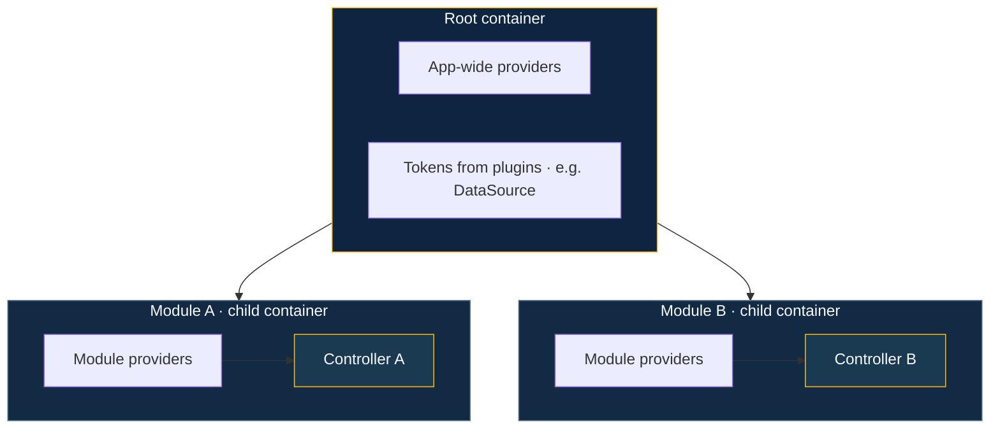
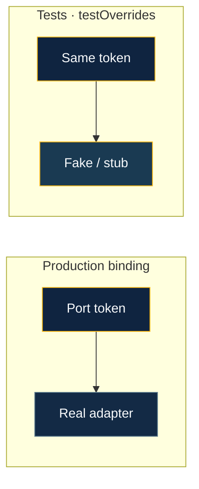

# Dependency injection

BananaJS uses **tsyringe** for DI. Constructors declare dependencies; the framework resolves them from containers tied to the app and to each feature module at startup. The goal: thin controllers, testable services, and explicit bindings rather than hidden singletons.

## Why DI?

Without DI, services get hard-wired together — untestable and coupled to specific implementations:

```typescript
// ❌ Without DI — hard to test, hard to swap
@Controller('users')
class UserController extends BaseController {
  private repo = new UserRepository()           // concrete dep baked in
  private cache = new RedisCache('localhost')   // env assumption in source code
}
```

With DI, you declare what you need and the framework builds it at startup:

```typescript
// ✅ With DI — testable, swappable, explicit
import { inject, injectable } from 'tsyringe'

@injectable()
class UserAppService {
  constructor(
    @inject(UserRepository) private readonly repo: UserRepository,
  ) {}
}

@Controller('users')
class UserController extends BaseController {
  constructor(
    @inject(UserAppService) private readonly service: UserAppService,
  ) { super() }
}
```

The framework builds `UserController` from its constructor — no manual wiring in application code.

## Container model

Plugins and root `providers` populate the **root** container; each `createModule` gets a **child** container so controllers and feature services resolve **in module scope**.



- **Root container** — holds app-wide registrations: plugins register shared connections/config here, plus optional `providers` from `defineBananaAppOptions`.
- **Per-module child container** — each `createModule` slice gets its own container. Controllers and module `providers` resolve here first; feature code stays scoped to that module.

**Plugins run before modules** — order in the `plugins` array matters.


## Step-by-step: registering a service

### 1. Mark the service injectable

```typescript
// src/user/UserAppService.ts
import { injectable, inject } from 'tsyringe'
import type { IUserRepository } from './IUserRepository'
import { USER_REPO } from './IUserRepository'

@injectable()
export class UserAppService {
  constructor(
    @inject(USER_REPO) private readonly repo: IUserRepository,
  ) {}

  async findById(id: string) {
    return this.repo.findById(id)
  }
}
```

### 2. Inject into the controller

```typescript
// src/user/UserController.ts
import { inject } from 'tsyringe'
import { Controller, Get, Params, NotFoundError } from '@banana-universe/bananajs'
import { BaseController } from '@banana-universe/bananajs'
import { z } from 'zod'
import { UserAppService } from './UserAppService'

const idSchema = z.object({ id: z.string().uuid() })

@Controller('users')
export class UserController extends BaseController {
  constructor(@inject(UserAppService) private readonly service: UserAppService) {
    super()
  }

  @Params(idSchema)
  @Get('items/:id')
  async getById(req: Request, res: Response) {
    const { id } = req.params as { id: string }
    const user = await this.service.findById(id)
    if (!user) throw new NotFoundError('User not found')
    return this.ok(res, 'ok', user)
  }
}
```

### 3. Register in a module

```typescript
// src/user/user.module.ts
import { createModule } from '@banana-universe/bananajs'
import { UserController } from './UserController'
import { UserAppService } from './UserAppService'
import { USER_REPO } from './IUserRepository'
import { PostgresUserRepository } from './infrastructure/PostgresUserRepository'

export const userModule = createModule({
  id: 'user',
  controller: UserController,
  providers: [
    UserAppService,
    { token: USER_REPO, useClass: PostgresUserRepository },
  ],
})
```

> **Note:** the `controller` is registered as a provider automatically. Do not add it to `providers` again.

### 4. Pass the module to BananaApp

```typescript
// src/main.ts
import { BananaApp } from '@banana-universe/bananajs'
import { userModule } from './user/user.module'

await BananaApp.create({ modules: [userModule] })
```

The framework creates a child container for `userModule`, registers `UserAppService` and the `USER_REPO` binding, then resolves `UserController` — dependencies are injected automatically.

## Port → adapter bindings (injection tokens)

For hexagonal / clean architecture, bind an **interface** (port) through a token so adapters can be swapped without changing the controller:

```typescript
// src/user/IUserRepository.ts
export interface IUserRepository {
  findById(id: string): Promise<User | null>
  save(user: User): Promise<void>
}

// Token — use a Symbol so it survives minification
export const USER_REPO = Symbol('IUserRepository')
```

```typescript
// inject by token in controller or service
import { inject } from 'tsyringe'

@Controller('users')
export class UserController extends BaseController {
  constructor(
    @inject(USER_REPO) private readonly repo: IUserRepository,
  ) { super() }
}
```

Other binding forms for `providers`:

```typescript
// useValue — for instances or plain objects
{ token: CONFIG_KEY, useValue: { pageSize: 20 } }

// useFactory — for lazy or conditional creation
{ token: CACHE_KEY, useFactory: (c) => new RedisCache(c.resolve(RedisClient)) }
```

## Root providers vs module providers

| | Root `providers` | Module `providers` |
|---|---|---|
| **Scope** | Available to all modules | Scoped to one module's child container |
| **When to use** | Config, shared event bus, logger adapter | Repos, feature services, mappers |
| **Registration** | `defineBananaAppOptions({ providers: [...] })` | `createModule({ providers: [...] })` |

## Controllers without modules

If you are not using `modules`, pass a flat `controllers` array. The framework resolves controllers from the **root** container.

```typescript
import { BananaApp, defineBananaControllers } from '@banana-universe/bananajs'

new BananaApp({
  controllers: defineBananaControllers(UserController, ProductController),
})
```

Root-level providers are supported too:

```typescript
import { defineBananaAppOptions } from '@banana-universe/bananajs'

new BananaApp(defineBananaAppOptions({
  controllers: [UserController],
  providers: [UserAppService, { token: USER_REPO, useClass: PostgresUserRepository }],
}))
```

Use this for simple apps. Switch to `modules` when you need per-feature isolation or run-time adapter swapping.

## Plugins and the container

`BananaPlugin.register(ctx)` receives `AppContext` with `ctx.container` (the root tsyringe container). Plugins use it to register shared infrastructure that all modules can later resolve:

```typescript
import type { BananaPlugin } from '@banana-universe/bananajs'

export const DATA_SOURCE = Symbol('DataSource')

export const dbPlugin: BananaPlugin = {
  name: 'db',
  async register(ctx) {
    if (!ctx.container) return    // guard: DI is optional
    const ds = await createDataSource()
    ctx.container.registerInstance(DATA_SOURCE, ds)
  },
  async onShutdown() {
    await dataSource.destroy()
  },
}
```

Any module instantiated after this plugin can resolve `DATA_SOURCE` from its child container. Plugins run **before** module container setup — so anything registered by a plugin is available to every module's `providers`.

## testOverrides

`testOverrides` on `BananaAppOptions` merges extra registrations onto the **root** container after modules — use it to swap real adapters for fakes in integration tests:

```typescript
// src/user/__tests__/user.integration.test.ts
import { BananaTestApp } from '@banana-universe/bananajs/testing'
import { userModule } from '../user.module'
import { USER_REPO } from '../IUserRepository'

const fakeRepo = new FakeUserRepository()

const app = await BananaTestApp.create({
  modules: [userModule],
  testOverrides: [
    { token: USER_REPO, useValue: fakeRepo },
  ],
})

test('GET /users/:id returns 200', async () => {
  fakeRepo.seed({ id: '00000000-0000-0000-0000-000000000001', name: 'Alice' })
  const res = await app.inject({ method: 'GET', url: '/users/items/00000000-0000-0000-0000-000000000001' })
  expect(res.statusCode).toBe(200)
})
```



## Learn more

- [Domain & persistence](/guide/domain-and-persistence) — ports, adapters, and `{ token, useClass }`
- [Layered architecture & DDD](/guide/layered-architecture) — `createModule` folder layout
- [BananaAppOptions](/reference/bananaapp-options) — `providers`, `testOverrides`, `container`
- [Advanced concepts](/guide/advanced-concepts) — modules and bootstrap options
- [Testing reference](/reference/testing) — full `BananaTestApp` guide
