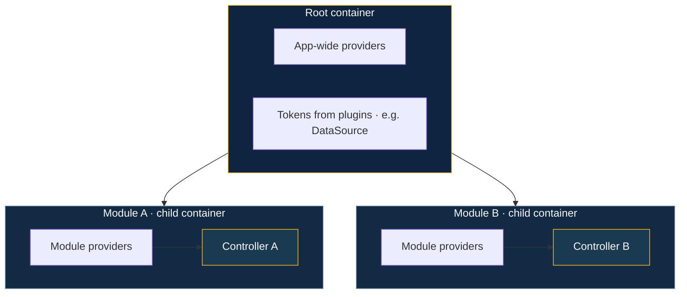
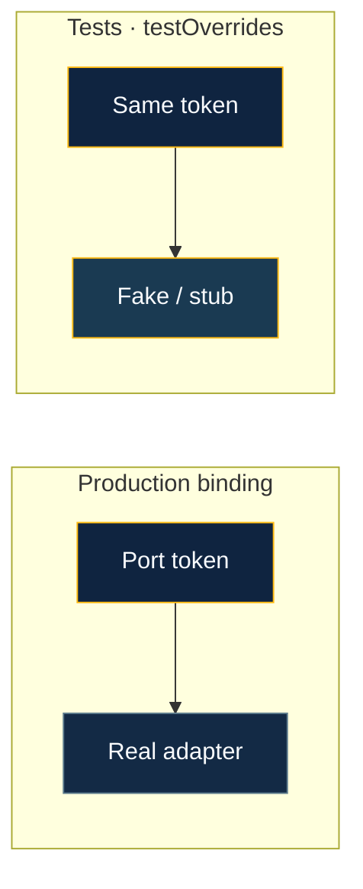

# Dependency injection

BananaJS uses **tsyringe** for DI: **constructors** declare dependencies, the framework **resolves** them from **containers** tied to the app and to each **feature module**. The goal is the same as elsewhere—**thin controllers**, **testable services**, and **explicit bindings** instead of hidden singletons.

**Containers at a glance:** plugins and root **`providers`** populate the **root** container; each **`createModule`** gets a **child** container so controllers and feature services resolve **in module scope** (with access to what the root already registered).

## Containers: root and modules

- **Root container** — Holds **app-wide** registrations: things **plugins** register (shared connections, config), plus optional **`providers`** you pass through **`defineBananaAppOptions`**.
- **Per-module child container** — Each **`createModule`** slice gets its **own** container. **Controllers** and **module `providers`** resolve here first, so feature code stays **scoped** to that module.

**Plugins** should run **before** module code needs their tokens—order in the **`plugins`** array matters (see [Domain & persistence](/guide/domain-and-persistence)).

## Registering services

- **`createModule({ id, controller, providers })`** — List **classes** and **`{ token, useClass | useFactory | useValue }`** entries. The **controller** is registered **automatically**; **do not** add it again under **`providers`**.
- **`defineBananaAppOptions({ modules: [...], providers: [...] })`** — Use **root `providers`** for cross-cutting bindings; use **module `providers`** for **port → adapter** pairs inside a slice.

**`Injectable`**, **`inject`**, and related helpers are aligned with **tsyringe** (re-exported from core for one import surface). Layer decorators from **`@banana-universe/ddd`** compose with the same model.

## Plugins vs HTTP handlers

**`BananaPlugin.register(ctx)`** receives **`AppContext`**: Express **`app`**, optional **`logger`**, **`container`** (the **root** **tsyringe** container), and **`controllerClasses`**. Plugins use **`ctx.container`** to register **shared** infrastructure (databases, clients) used across modules.

**Controllers and services** are resolved from the **module child container** or **root** when the framework builds route handlers (**`container.resolve(Controller)`**). Prefer **constructor injection** on **`@Injectable()`** classes—there is **no** separate per-request DI context; instances are created **eagerly** at startup by default (**`lazyControllers`** defers instantiation to the first request).

## Testing

**`testOverrides`** on **`BananaAppOptions`** merges extra registrations onto the **root** container after modules—use it to **swap** implementations with **fakes** or **stubs** in integration tests (**`BananaTestApp`**).

## Learn more

- [Domain & persistence](/guide/domain-and-persistence) — ports, adapters, and **`{ token, useClass }`**
- [Layered architecture & DDD](/guide/layered-architecture) — **`createModule`** layout
- [BananaAppOptions](/reference/bananaapp-options) — **`providers`**, **`testOverrides`**, **`container`**
- [Advanced concepts](/guide/advanced-concepts) — modules and bootstrap
