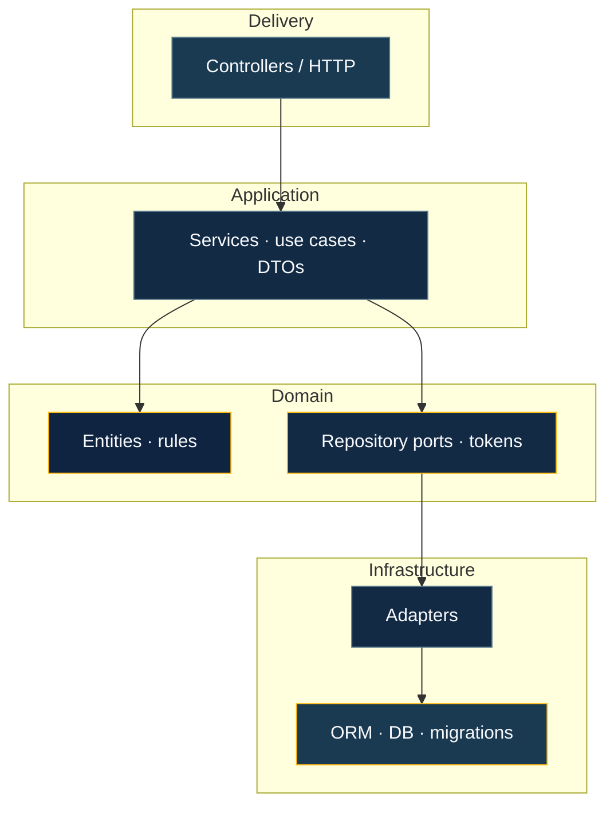
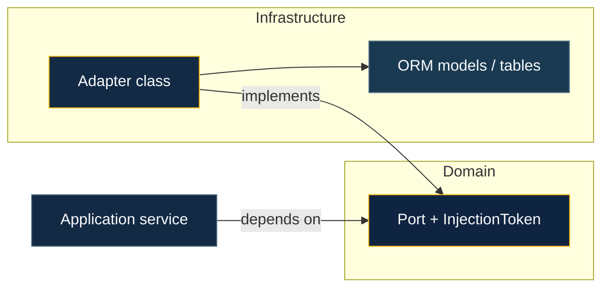

# Domain & persistence

This page is about **where business logic lives** versus **where storage and ORMs live**, and how BananaJS keeps them apart so you can test and evolve each side independently.

**Flow (who talks to whom):** HTTP stays thin; **application** services orchestrate; **domain** holds rules; **ports** describe persistence needs; **adapters** and the **ORM** sit outside the domain.

## Domain layer

The **domain** holds **business rules** and your **model** (entities, value objects, invariants). It should not import **Express**, **HTTP**, or **ORM APIs**—those belong outside.

- **Application services** orchestrate use cases: they call **domain** and **ports**, validate inputs with **DTOs** (often **Zod**), and return results suitable for HTTP.
- **Repository ports** (interfaces or abstract contracts + **injection tokens**) describe _what_ you need from persistence (**find by id**, **save**, **search**) without naming tables or documents.
- Optionally use **`@banana-universe/ddd`** for **Entity**, **ValueObject**, **AggregateRoot**, **Repository**, **FindCriteria**, **UnitOfWork**, and layer decorators—see [Layered architecture](/guide/layered-architecture).

## Persistence and infrastructure

**Persistence** is an **infrastructure** concern: **TypeORM entities**, **Mongoose models**, SQL, indexes, migrations, connection pools. Adapters **implement** your repository ports and **map** between **domain objects** and **persistence shapes** (`toDomain` / `toPersistence`).

Official **plugins** (**TypeORM**, **Mongoose**) register shared resources (for example a **`DataSource`** or connection) on the app container so adapters can resolve them. Details and APIs: [TypeORM](/integrations/typeorm), [Mongoose](/integrations/mongoose).

## Ports and adapters

A typical flow:

1. Define a **port** in **domain** (interface + token).
2. Implement an **adapter** under **`infrastructure/`** that uses the ORM and implements the port.
3. In a **feature module**, register **`{ token, useClass }`** so the application layer receives the adapter when it asks for the port.

That keeps **domain** free of storage details and lets you swap or fake adapters in tests.

At runtime the module binds **token → adapter**, so **use cases** only see the **port**.

## Plugins and module order

**Plugins** run so shared infrastructure (database connections, etc.) is available **before** feature **modules** resolve **providers**. If something “cannot resolve” at startup, check that the right **plugin** is registered and ordered before modules that depend on it.

## Transactions

When a use case must commit several writes together, use **Unit of Work** patterns and ORM-level transactions (**`@Transactional()`** where the plugin provides it). Keep transaction boundaries in **application** or **infrastructure**—not in raw controllers.

## Learn more

- [Dependency injection](/guide/dependency-injection) — containers, **`providers`**, plugin **`AppContext`**, **`testOverrides`**
- [Layered architecture & DDD](/guide/layered-architecture) — folder layout, CLI scaffolds, **`FindCriteria`**
- [Basic concepts](/guide/basic-concepts) — **`BananaApp.create`**, modules, **`defineBananaAppOptions`**
- [AI module generation](/tooling/ai-module-generation) — **`bjs ai generate --module`**
- [Recipes](/recipes/) — full examples with **`createModule`** and layered folders
