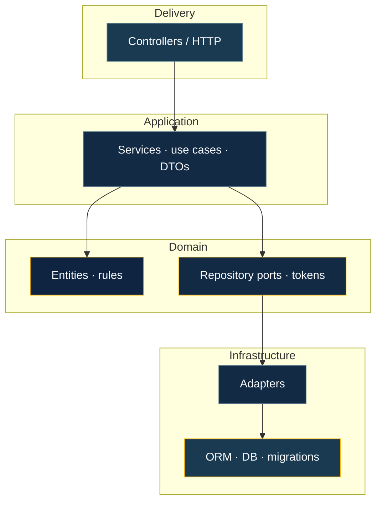
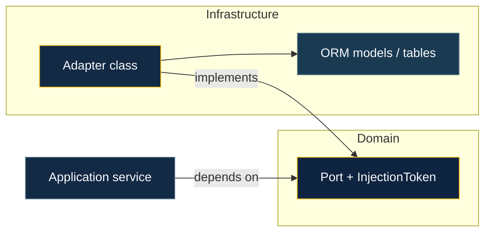

# Domain & persistence

This page is about **where business logic lives** versus **where storage and ORMs live**, and how BananaJS keeps them apart so you can test and evolve each side independently.

**Flow (who talks to whom):** HTTP stays thin; **application** services orchestrate; **domain** holds rules; **ports** describe persistence needs; **adapters** and the **ORM** sit outside the domain.



## Domain layer

The domain holds business rules and your model. It must not import Express, HTTP, or ORM APIs.

```typescript
// domain/Article.entity.ts
import { Entity } from '@banana-universe/ddd'

export interface ArticleProps {
  id: string; title: string; body: string
  createdAt: Date; updatedAt: Date
}

export class Article extends Entity<ArticleProps> {
  constructor(props: ArticleProps) { super(props) }
  get title() { return this.props.title }
  get body()  { return this.props.body  }
}
```

**Application services** orchestrate use cases — they call domain and ports, validate inputs via DTOs (Zod), and return results suitable for HTTP. They do not know about databases.

**Repository ports** (interface + injection token) describe _what_ you need from persistence without naming a table, collection, or ORM:

```typescript
// domain/Article.repository.ts
import type { Repository } from '@banana-universe/ddd'
import type { InjectionToken } from 'tsyringe'
import type { Article } from './Article.entity.js'

export type ArticleRepository = Repository<Article>
// Repository<T> provides: findById, findAll, save, delete

export const ArticleRepositoryToken = Symbol(
  'ArticleRepository',
) as InjectionToken<ArticleRepository>
```

Use `@banana-universe/ddd` for `Entity`, `ValueObject`, `AggregateRoot`, `Repository`, `FindCriteria`, `UnitOfWork`, and layer decorators — see [Layered architecture](/guide/layered-architecture).

## Persistence and infrastructure

Infrastructure implements your ports and maps between domain objects and ORM shapes. Two patterns — one per ORM:

### TypeORM adapter

```typescript
// infrastructure/Article.typeorm-repository.ts
import { injectable, inject } from 'tsyringe'
import { TypeOrmRepositoryAdapter } from '@banana-universe/plugin-typeorm'
import { Article } from '../domain/Article.entity.js'
import { ArticleOrmEntity } from './Article.orm-entity.js'

@injectable()
export class ArticleTypeOrmRepository
  extends TypeOrmRepositoryAdapter<Article, ArticleOrmEntity>
{
  constructor(@inject('dataSource') dataSource: DataSource) {
    super(dataSource, ArticleOrmEntity)
  }

  toDomain(orm: ArticleOrmEntity): Article {
    return new Article({ id: orm.id, title: orm.title, body: orm.body,
      createdAt: orm.createdAt, updatedAt: orm.updatedAt })
  }

  toPersistence(domain: Article): ArticleOrmEntity {
    const row = new ArticleOrmEntity()
    row.id = domain.id; row.title = domain.title; row.body = domain.body
    row.createdAt = domain.createdAt; row.updatedAt = domain.updatedAt
    return row
  }
}
```

### Mongoose adapter

```typescript
// infrastructure/Article.mongoose-repository.ts
import { injectable, inject } from 'tsyringe'
import { MongooseRepositoryAdapter } from '@banana-universe/plugin-mongoose'
import { Article } from '../domain/Article.entity.js'
import { getArticleModel, type ArticleDoc } from './Article.mongoose-model.js'

@injectable()
export class ArticleMongooseRepository
  extends MongooseRepositoryAdapter<Article, ArticleDoc>
{
  constructor(@inject('mongooseConnection') connection: Connection) {
    super(getArticleModel(connection))
  }

  toDomain(doc: ArticleDoc): Article {
    return new Article({ id: String(doc._id), title: doc.title, body: doc.body,
      createdAt: doc.createdAt, updatedAt: doc.updatedAt })
  }

  toPersistence(domain: Article): Partial<ArticleDoc> {
    return { _id: domain.id, title: domain.title, body: domain.body,
      createdAt: domain.createdAt, updatedAt: domain.updatedAt }
  }
}
```

The plugin (`TypeOrmPlugin` / `MongoosePlugin`) registers `'dataSource'` / `'mongooseConnection'` on the root container so adapters can `@inject` them. Details: [TypeORM](/integrations/typeorm), [Mongoose](/integrations/mongoose).

## Ports and adapters — step by step

A typical feature follows three steps:

### 1. Define a port in domain

Interface + injection token in `domain/Article.repository.ts` — shown above.

### 2. Implement an adapter in infrastructure

Adapter class (TypeORM or Mongoose) — shown above. The adapter `implements` the port through `toDomain` / `toPersistence`.

### 3. Bind token → adapter in the module

```typescript
// index.ts
import { createModule } from '@banana-universe/bananajs'
import { ArticleController } from './Article.controller.js'
import { ArticleAppService } from './application/Article.service.js'
import { ArticleMongooseRepository } from './infrastructure/Article.mongoose-repository.js'
import { ArticleRepositoryToken } from './domain/Article.repository.js'

export const articlesModule = createModule({
  id: 'articles',
  controller: ArticleController,
  providers: [
    { token: ArticleRepositoryToken, useClass: ArticleMongooseRepository },
    ArticleAppService,
  ],
})
```

The application service depends on `ArticleRepositoryToken` via `@inject` — it never imports the concrete adapter. Swapping adapters (e.g. Mongoose → TypeORM) requires changing one line in `index.ts`.



At runtime the module binds **token → adapter**, so **use cases** only see the **port**.

## Plugins and module order

Plugins register shared infrastructure (DB connections, etc.) on the **root** container **before** feature modules resolve providers. If a module cannot resolve a token at startup, the plugin is either missing or ordered after the module that needs it.

```typescript
import { BananaApp } from '@banana-universe/bananajs'
import { TypeOrmPlugin } from '@banana-universe/plugin-typeorm'
import { articlesModule } from './modules/articles/index.js'

const app = await BananaApp.create({
  plugins: [TypeOrmPlugin({ entities: [ArticleOrmEntity], ...dbConfig })],  // runs first
  modules: [articlesModule],                                                 // resolves after
})
```


## Testing with fake repositories

Because the application service depends on the **port token**, not the concrete adapter, tests can inject a fake:

```typescript
// __tests__/article.integration.test.ts
import { BananaTestApp } from '@banana-universe/bananajs/testing'
import { articlesModule } from '../index.js'
import { ArticleRepositoryToken } from '../domain/Article.repository.js'

class FakeArticleRepository implements ArticleRepository {
  private items = new Map<string, Article>()
  async findById(id: string) { return this.items.get(id) ?? null }
  async findAll() { return [...this.items.values()] }
  async save(a: Article) { this.items.set(a.id, a); return a }
  async delete(id: string) { this.items.delete(id) }
}

const fake = new FakeArticleRepository()

const app = await BananaTestApp.create({
  modules: [articlesModule],
  testOverrides: [{ token: ArticleRepositoryToken, useValue: fake }],
})

test('POST /articles creates an article', async () => {
  const res = await app.inject({
    method: 'POST', url: '/articles',
    body: { title: 'Hello', body: 'World' },
  })
  expect(res.statusCode).toBe(200)
  expect(fake.items.size).toBe(1)
})
```

No database required — tests run in milliseconds. See [Testing reference](/reference/testing) for the full guide.

## Transactions

Keep transaction boundaries in the **application** or **infrastructure** layer — not in controllers. With TypeORM or Mongoose, use `UnitOfWork` from `@banana-universe/ddd` and the ORM-level `@Transactional()` decorator provided by the plugin. Transaction scope should wrap the entire cross-aggregate write, not individual repository calls.

## Learn more

- [Dependency injection](/guide/dependency-injection) — containers, **`providers`**, plugin **`AppContext`**, **`testOverrides`**
- [Layered architecture & DDD](/guide/layered-architecture) — folder layout, CLI scaffolds, **`FindCriteria`**
- [Basic concepts](/guide/basic-concepts) — **`BananaApp.create`**, modules, **`defineBananaAppOptions`**
- [AI module generation](/tooling/ai-module-generation) — **`bjs ai generate --module`**
- [Recipes](/recipes/) — full examples with **`createModule`** and layered folders
