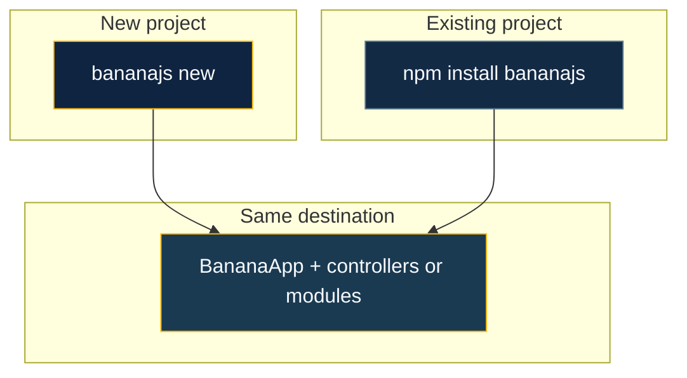

# Getting Started

BananaJS (**`@banana-universe/bananajs`**) is TypeScript on **Express**: decorators, built-in **validation**, typed responses and errors, optional **modules** with **tsyringe**, and a CLI for scaffolding and AI-assisted workflows. Read [**Philosophy**](/guide/philosophy) for the product stance; this page is **how to run something**.

**Prerequisites:** **Node.js 20+** and **npm**, **pnpm**, or **yarn**.



Pick **one** path below.

<div class="guide-steps">

## 1. New app — CLI

The CLI creates a **new folder** from **built-in presets** (**`sql`** → TypeORM / PostgreSQL-shaped, **`mongodb`** → Mongoose). Everything is written to disk—**no git clone**, no external template repo.

**Run** (use **`bananajs`** or **`bjs`** interchangeably):

::: code-group

```bash [npm]
npx @banana-universe/bananajs-cli new my-app
```

```bash [pnpm]
pnpm dlx @banana-universe/bananajs-cli new my-app
```

```bash [yarn]
yarn dlx @banana-universe/bananajs-cli new my-app
```

:::

Global install:

::: code-group

```bash [npm]
npm install -g @banana-universe/bananajs-cli
bjs new my-app
```

```bash [pnpm]
pnpm add -g @banana-universe/bananajs-cli
bjs new my-app
```

```bash [yarn]
yarn global add @banana-universe/bananajs-cli
bjs new my-app
```

:::

### Presets and CI

In scripts or CI, pass **`--preset`** so the choice is never ambiguous:

::: code-group

```bash [npm]
npx @banana-universe/bananajs-cli new my-app --preset sql
npx @banana-universe/bananajs-cli new my-app --preset mongodb
```

```bash [pnpm]
pnpm dlx @banana-universe/bananajs-cli new my-app --preset sql
pnpm dlx @banana-universe/bananajs-cli new my-app --preset mongodb
```

```bash [yarn]
yarn dlx @banana-universe/bananajs-cli new my-app --preset sql
yarn dlx @banana-universe/bananajs-cli new my-app --preset mongodb
```

:::

If **stdin is not a TTY** and **`--preset`** is omitted, the CLI defaults to **`sql`** and tells you to pass **`--preset mongodb`** when you want MongoDB.

### Interactive prompts (TTY only)

1. **App name** — Omitted name → prompt (suggestion: **`my-bananajs-app`**).
2. **Preset** — **MongoDB** (Mongoose) vs **SQL** (TypeORM).

### After generation

1. **`cd my-app`** (or the name you chose).
2. **Install:** `npm install` / `pnpm install` / `yarn install`.
3. Copy **`.env.example`** → **`.env`** when present; set **`DATABASE_URL`** (and **`PORT`** if needed). Entry files load config via **`dotenv`** (`import 'dotenv/config'` in **`main.ts`**).
4. **`npm run build`** then **`npm start`** (or your package manager’s equivalents). The CLI prints a short hint.

### What you get (presets)

- **OpenAPI** — `swagger.enabled` in **`defineBananaAppOptions`**: UI at **`/api-docs`**, JSON at **`/api-docs.json`**. The scaffold includes **`swagger-ui-express`**; you can swap in another viewer later. Details: [Advanced concepts](/guide/advanced-concepts).
- **Lint & format** — ESLint 9 flat config + Prettier (**tab width 4**), **`.editorconfig`**, **`lint`** / **`format`** scripts.
- **Database** — **MongoDB:** `src/db/mongo.ts`. **SQL:** `src/db/typeorm-options.ts` + **`DATABASE_URL`**.
- **Modules** — Features under **`src/modules/<feature>/`** with **`createModule`** (BananaJS **v0.6+**). Deeper layout: [Layered architecture](/guide/layered-architecture).

**More CLI:** **`bjs generate`** (alias **`g`**) for controllers, DTOs, middleware, **modules**; **`routes`**, **`openapi`**, **`migrate`**, **`db`**, **`ai`** ( **`ai setup`**, **`ai generate`**, review, wire, … ). Full reference: [CLI](/tooling/cli) · [AI commands](/tooling/ai-commands).

## 2. Existing app — add BananaJS

Install packages, enable **decorators** in **`tsconfig.json`**, and import **`reflect-metadata`** once at the **top** of your entry file (before any controllers).

::: code-group

```bash [npm]
npm install @banana-universe/bananajs reflect-metadata express zod
npm install -D typescript @types/node @types/express
```

```bash [pnpm]
pnpm add @banana-universe/bananajs reflect-metadata express zod
pnpm add -D typescript @types/node @types/express
```

```bash [yarn]
yarn add @banana-universe/bananajs reflect-metadata express zod
yarn add -D typescript @types/node @types/express
```

:::

```typescript
import 'reflect-metadata'
import { BananaApp, defineBananaControllers } from '@banana-universe/bananajs'
import { UserController } from './user.controller.js'

new BananaApp({
  controllers: defineBananaControllers(UserController),
})
  .getInstance()
  .listen(3000)
```

For incremental adoption and Express migration, see [From Express](/migration/from-express). Concepts and options: [Basic concepts](/guide/basic-concepts), [Advanced concepts](/guide/advanced-concepts), [Dependency injection](/guide/dependency-injection).

Install **`@banana-universe/bananajs-cli`** in the repo if you want **`bjs`** helpers (**`generate`**, **`routes`**, **`openapi`**, **`ai`**) without a global install.

</div>

## Next

| Topic                                                               | Link                                  |
| ------------------------------------------------------------------- | ------------------------------------- |
| Example apps (PostgreSQL, Mongo, Fastify, WebSockets, multi-tenant) | [Recipes](/recipes/)                  |
| Auth guard and decorators                                           | [Authentication](/integrations/auth)  |
| ORMs and integrations                                               | [Integrations](/integrations/typeorm) |
| Plugins                                                             | [Plugins](/plugins/overview)          |
