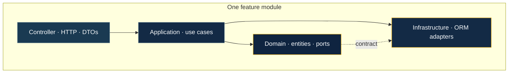
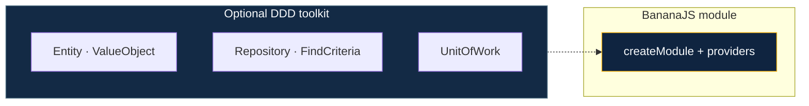
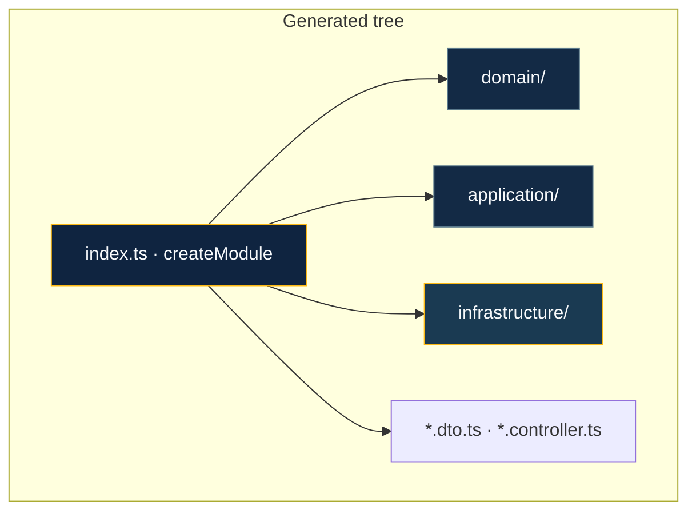

# Layered architecture & DDD

BananaJS supports **feature modules** built with **`createModule`**: one HTTP controller per slice, **domain** and **application** layers, and **infrastructure** adapters. Think of each **`src/modules/<feature>/`** folder as a **vertical slice**—HTTP at the edge, rules in the middle, storage at the bottom.



**Dependency direction:** **application** orchestrates and calls **domain** + **ports**; **infrastructure** implements ports. Controllers stay thin—they validate input, call application services, return responses.

The **`bjs generate module`** command scaffolds the same **`src/modules/<feature>/`** layout as **`bjs new`** presets: **`index.ts`** with **`createModule`**, repository tokens, and ORM adapters. When **`src/bootstrap.ts`** (or another file with **`defineBananaAppOptions`** + **`modules:`**) is found, the CLI **imports and registers** the new module and, for **TypeORM**, appends the entity to **`entities: [...]`** where possible. Use **`--skip-bootstrap`** to only write files under **`src/modules/`**.

For **how domain logic relates to databases and ORMs** (ports, adapters, plugins), see [Domain & persistence](/guide/domain-and-persistence). For **tsyringe** containers, **`providers`**, and plugin **`AppContext`**, see [Dependency injection](/guide/dependency-injection).

::: info `@banana-universe/ddd`
The **`ddd`** package provides **Entity**, **ValueObject**, **AggregateRoot**, **Repository** / **FindCriteria**, **UnitOfWork**, and **@DomainService** / **@ApplicationService** (layer metadata + `Injectable`). Use **`bjs g`** (or **`bjs generate`**) and omit args in a TTY to pick **controller** / **dto** / **middleware** / **module**, or **`bjs generate module <name>`** for a non-interactive layered scaffold; **`bjs ai generate --module`** produces the same tree from a schema or description.
:::



## Manual layout

You can structure code as **domain / application / infrastructure** without the package—BananaJS does not force a flat layout. **Plugins** (`TypeOrmPlugin`, `MongoosePlugin`, …) attach **infrastructure** at the edges while **controllers** stay thin.

Feature folders use **lowercase** names. Preset apps and recipes use **`src/modules/<feature>/`** (e.g. **`src/modules/articles/`**). Inside a slice, files use **dotted role names** (PascalCase feature or entity prefix + `.` + role): **`Article.controller.ts`**, **`CatalogItem.entity.ts`**, **`Article.service.ts`**.

## CLI scaffold (`bjs generate module`)

**Command:** **`bjs generate module <name> [--orm typeorm|mongoose|none] [--out <dir>] [--skip-bootstrap]`** — or run **`bjs g`** with no arguments in a TTY to be prompted for type and name.

- **Default `--out`:** **`src`** relative to the **current working directory** (run the CLI from your app folder).
- **Default `--orm`:** **`typeorm`** when stdin is **not** a TTY; in an interactive terminal you choose **TypeORM**, **Mongoose**, or **none** (in-memory repository).

Output is written under **`<out>/modules/<kebab-name>/`** (e.g. **`src/modules/my-widget/`** for **`bjs generate module my-widget`**).

**Shape** (matches **`bananajs new`** presets and **`buildDddModuleFiles`** in **`bananajs-cli`**):

```
<out>/modules/<kebab-name>/
  domain/
    <Name>.entity.ts
    <Name>.repository.ts          # Repository<T> port + DI token
  application/
    <Name>.service.ts             # <Name>AppService — @injectable() + repository
  infrastructure/
    <Name>.orm-entity.ts          # if --orm typeorm
    <Name>.typeorm-repository.ts
    # OR <Name>.mongoose-model.ts + <Name>.mongoose-repository.ts  # mongoose
    # OR <Name>.in-memory-repository.ts     # if --orm none
  <Name>.dto.ts
  <Name>.controller.ts
  index.ts                        # createModule + providers
```

Bootstrap wiring is applied automatically unless **`--skip-bootstrap`** is set.



## Repository examples in this repo

Example apps follow the same **layered** idea with small **naming/layout** differences from the raw CLI template:

| App                                | Module                 | Notes                                                                                                                                                                                                                                             |
| ---------------------------------- | ---------------------- | ------------------------------------------------------------------------------------------------------------------------------------------------------------------------------------------------------------------------------------------------- |
| **`apps/example-rest-postgresql`** | **`modules/catalog`**  | Domain port **`CatalogItem.mapper.ts`**; DTO as **`Catalog.dto.ts`** at module root; TypeORM files under **`infrastructure/`** (no **`typeorm/`** subfolder); application class **`CatalogAppService`** in **`application/Catalog.service.ts`**.  |
| **`apps/example-rest-mongodb`**    | **`modules/articles`** | Domain port **`Article.repository.ts`** (same role as **`*.mapper.ts`** in the CLI); **`Article.dto.ts`** at module root; **`Article.mongoose-model.ts`** + **`Article.mongoose-repository.ts`**; exports **`createModule`** from **`index.ts`**. |

Use these as **copy-paste** references for **`createModule`**, **tsyringe** **`@inject`**, and plugin bootstrap.

## Principles

- **Domain** — business rules and model; **no Express**, **no ORM entities** in this layer
- **Application** — orchestration, use cases, DTOs at the boundary
- **Infrastructure** — TypeORM / Mongoose / messaging / external APIs; **mappers** `toDomain` / `toPersistence` keep persistence honest

## Repository model

**`FindCriteria<T>`** (eq / in / like / gt / lt, sorting, paging) keeps queries **explicit and testable**—not a vague `Partial<T>`.

## Transactions

**`UnitOfWork`** plus ORM-specific implementations align application services that touch multiple aggregates; **`@Transactional()`** in plugins exists at the persistence layer for TypeORM and Mongoose.

## Learn more

- [Dependency injection](/guide/dependency-injection) — root vs module containers, **`providers`**, **`createModule`**, testing
- [Domain & persistence](/guide/domain-and-persistence) — domain vs storage, ports and adapters, plugins
- [Philosophy](/guide/philosophy) — DDD and product direction
- [AI module generation](/tooling/ai-module-generation) — LLM-driven **`bjs ai generate --module`**
- [TypeORM integration](/integrations/typeorm) — plugins and repository adapters
- [Mongoose integration](/integrations/mongoose) — plugins and adapters
- [Recipes](/recipes/) — runnable apps with **`createModule`** and layered folders
