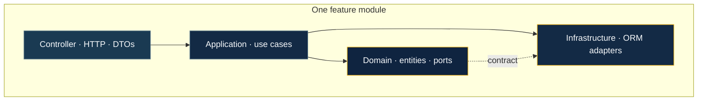
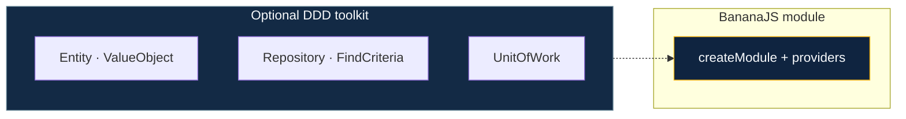
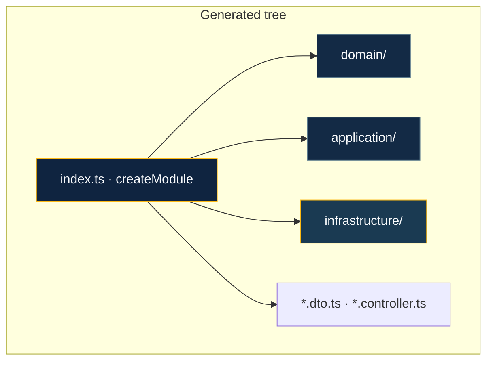

# Layered architecture & DDD

BananaJS supports **feature modules** built with **`createModule`**: one HTTP controller per slice, **domain** and **application** layers, and **infrastructure** adapters. Think of each **`src/modules/<feature>/`** folder as a **vertical slice**—HTTP at the edge, rules in the middle, storage at the bottom.



**Dependency direction:** **application** orchestrates and calls **domain** + **ports**; **infrastructure** implements ports. Controllers stay thin—they validate input, call application services, return responses.

The **`bjs generate module`** command scaffolds the same **`src/modules/<feature>/`** layout as **`bjs new`** presets: **`index.ts`** with **`createModule`**, repository tokens, and ORM adapters. When **`src/bootstrap.ts`** (or another file with **`defineBananaAppOptions`** + **`modules:`**) is found, the CLI **imports and registers** the new module and, for **TypeORM**, appends the entity to **`entities: [...]`** where possible. Use **`--skip-bootstrap`** to only write files under **`src/modules/`**.

For **how domain logic relates to databases and ORMs** (ports, adapters, plugins), see [Domain & persistence](/guide/domain-and-persistence). For **tsyringe** containers, **`providers`**, and plugin **`AppContext`**, see [Dependency injection](/guide/dependency-injection).

::: info `@banana-universe/ddd`
The **`ddd`** package provides **Entity**, **ValueObject**, **AggregateRoot**, **Repository** / **FindCriteria**, **UnitOfWork**, and **@DomainService** / **@ApplicationService** (layer metadata + `Injectable`). Use **`bjs g`** (or **`bjs generate`**) and omit args in a TTY to pick **controller** / **dto** / **middleware** / **module**, or **`bjs generate module <name>`** for a non-interactive layered scaffold; **`bjs ai generate --module`** produces the same tree from a schema or description.
:::



## Standard folder layout

Feature modules live under `src/modules/<feature>/`. Inside each slice, files use **dotted role names** (`PascalCase` entity or feature prefix + `.` + role):

```
src/
  modules/
    article/
      domain/
        Article.entity.ts           # extends Entity<ArticleProps> from @banana-universe/ddd
        Article.repository.ts       # Repository<Article> interface + InjectionToken
      application/
        Article.service.ts          # @injectable() orchestration class
      infrastructure/
        Article.mongoose-model.ts   # Mongoose schema + model
        Article.mongoose-repo.ts    # @injectable() adapter — implements port
      Article.controller.ts         # @Controller + HTTP methods
      Article.dto.ts                # Zod schemas for request/response
      index.ts                      # createModule({ id, controller, providers })
```

For TypeORM the `infrastructure/` subfolder contains `Article.orm-entity.ts` (TypeORM `@Entity`) and `Article.typeorm-repository.ts` instead.

## CLI scaffold (`bjs generate module`)

**Command:** **`bjs generate module <name> [--orm typeorm|mongoose|none] [--out <dir>] [--skip-bootstrap]`** — or run **`bjs g`** with no arguments in a TTY to be prompted for type and name.

- **Default `--out`:** **`src`** relative to the **current working directory** (run the CLI from your app folder).
- **Default `--orm`:** **`typeorm`** when stdin is **not** a TTY; in an interactive terminal you choose **TypeORM**, **Mongoose**, or **none** (in-memory repository).

Output is written under **`<out>/modules/<kebab-name>/`** (e.g. **`src/modules/my-widget/`** for **`bjs generate module my-widget`**).

**Shape** (matches **`bananajs new`** presets and **`buildDddModuleFiles`** in **`bananajs-cli`**):

```
<out>/modules/<kebab-name>/
  domain/
    <Name>.entity.ts
    <Name>.repository.ts          # Repository<T> port + DI token
  application/
    <Name>.service.ts             # <Name>AppService — @injectable() + repository
  infrastructure/
    <Name>.orm-entity.ts          # if --orm typeorm
    <Name>.typeorm-repository.ts
    # OR <Name>.mongoose-model.ts + <Name>.mongoose-repository.ts  # mongoose
    # OR <Name>.in-memory-repository.ts     # if --orm none
  <Name>.dto.ts
  <Name>.controller.ts
  index.ts                        # createModule + providers
```

Bootstrap wiring is applied automatically unless **`--skip-bootstrap`** is set.



## Repository examples in this repo

Example apps follow the same **layered** idea with small **naming/layout** differences from the raw CLI template:

| App                                | Module                 | Notes                                                                                                                                                                                                                                             |
| ---------------------------------- | ---------------------- | ------------------------------------------------------------------------------------------------------------------------------------------------------------------------------------------------------------------------------------------------- |
| **`apps/example-rest-postgresql`** | **`modules/catalog`**  | Domain port **`CatalogItem.mapper.ts`**; DTO as **`Catalog.dto.ts`** at module root; TypeORM files under **`infrastructure/`** (no **`typeorm/`** subfolder); application class **`CatalogAppService`** in **`application/Catalog.service.ts`**.  |
| **`apps/example-rest-mongodb`**    | **`modules/articles`** | Domain port **`Article.repository.ts`** (same role as **`*.mapper.ts`** in the CLI); **`Article.dto.ts`** at module root; **`Article.mongoose-model.ts`** + **`Article.mongoose-repository.ts`**; exports **`createModule`** from **`index.ts`**. |

Use these as **copy-paste** references for **`createModule`**, **tsyringe** **`@inject`**, and plugin bootstrap.

## Layer responsibilities

| Layer | Files | Rules |
|---|---|---|
| **Domain** | `*.entity.ts`, `*.repository.ts` | No Express, no ORM, no HTTP imports — pure business logic |
| **Application** | `*.service.ts` | Orchestrates domain + ports; receives validated DTOs; no Express `req`/`res` |
| **Infrastructure** | `*.typeorm-repository.ts`, `*.mongoose-repository.ts` | Implements port; maps ORM ↔ domain objects; knows about DB |
| **Delivery** | `*.controller.ts`, `*.dto.ts` | Thin; validates input with Zod; delegates to application service; returns response |

### Domain entity

```typescript
// domain/Article.entity.ts
import { Entity } from '@banana-universe/ddd'

export interface ArticleProps {
  id: string
  title: string
  body: string
  createdAt: Date
  updatedAt: Date
}

export class Article extends Entity<ArticleProps> {
  constructor(props: ArticleProps) { super(props) }

  get title() { return this.props.title }
  get body()  { return this.props.body  }
}
```

### Port (repository interface + token)

```typescript
// domain/Article.repository.ts
import type { Repository } from '@banana-universe/ddd'
import type { InjectionToken } from 'tsyringe'
import type { Article } from './Article.entity.js'

export type ArticleRepository = Repository<Article>

export const ArticleRepositoryToken = Symbol(
  'ArticleRepository',
) as InjectionToken<ArticleRepository>
```

### Application service

```typescript
// application/Article.service.ts
import { randomUUID } from 'node:crypto'
import { injectable, inject } from 'tsyringe'
import type { ArticleRepository } from '../domain/Article.repository.js'
import { ArticleRepositoryToken } from '../domain/Article.repository.js'
import { Article } from '../domain/Article.entity.js'

@injectable()
export class ArticleAppService {
  constructor(
    @inject(ArticleRepositoryToken)
    private readonly repo: ArticleRepository,
  ) {}

  async create(title: string, body: string): Promise<Article> {
    const now = new Date()
    return this.repo.save(new Article({ id: randomUUID(), title, body, createdAt: now, updatedAt: now }))
  }
}
```

### Module wiring (`index.ts`)

```typescript
// index.ts
import { createModule } from '@banana-universe/bananajs'
import { ArticleController } from './Article.controller.js'
import { ArticleAppService } from './application/Article.service.js'
import { ArticleMongooseRepository } from './infrastructure/Article.mongoose-repository.js'
import { ArticleRepositoryToken } from './domain/Article.repository.js'

export const articlesModule = createModule({
  id: 'articles',
  controller: ArticleController,
  providers: [
    { token: ArticleRepositoryToken, useClass: ArticleMongooseRepository },
    ArticleAppService,
  ],
})
```

## Repository model

`Repository<T>` from `@banana-universe/ddd` defines four methods:

```typescript
interface Repository<T, ID = string> {
  findById(id: ID): Promise<T | null>
  findAll(criteria?: FindCriteria<T>): Promise<T[]>
  save(entity: T): Promise<T>
  delete(id: ID): Promise<void>
}
```

`FindCriteria<T>` keeps queries **explicit and testable** — no raw SQL leaking into application code:

```typescript
import type { FindCriteria } from '@banana-universe/ddd'
import type { Article } from './Article.entity.js'

// In application service:
const recent = await this.repo.findAll({
  where:   { title: { like: 'BananaJS' } },
  orderBy: { field: 'createdAt', direction: 'desc' },
  limit:   20,
  offset:  0,
})
```

Supported operators: `eq`, `in`, `like`, `gt`, `lt`.

## Transactions

Keep transaction boundaries in the **application** or **infrastructure** layer — not in controllers. With TypeORM or Mongoose, use `UnitOfWork` from `@banana-universe/ddd` and the ORM-level `@Transactional()` decorator the plugin provides:

```typescript
// application/Order.service.ts
@injectable()
export class OrderAppService {
  constructor(
    @inject(OrderRepositoryToken) private readonly orders: OrderRepository,
    @inject(PaymentRepositoryToken) private readonly payments: PaymentRepository,
  ) {}

  async placeOrder(dto: PlaceOrderDto): Promise<Order> {
    // Both writes must succeed or both must fail — handled at infrastructure layer
    const order   = await this.orders.save(Order.create(dto))
    await this.payments.save(Payment.pending(order.id, dto.amount))
    return order
  }
}
```

## Learn more

- [Dependency injection](/guide/dependency-injection) — root vs module containers, **`providers`**, **`createModule`**, testing
- [Domain & persistence](/guide/domain-and-persistence) — domain vs storage, ports and adapters, plugins
- [Philosophy](/guide/philosophy) — DDD and product direction
- [AI module generation](/tooling/ai-module-generation) — LLM-driven **`bjs ai generate --module`**
- [TypeORM integration](/integrations/typeorm) — plugins and repository adapters
- [Mongoose integration](/integrations/mongoose) — plugins and adapters
- [Recipes](/recipes/) — runnable apps with **`createModule`** and layered folders
