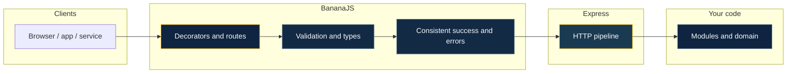
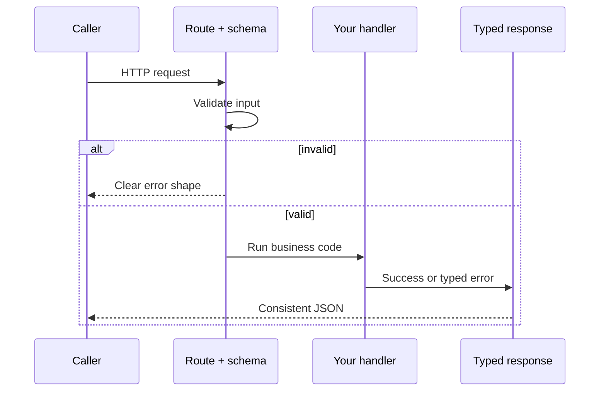
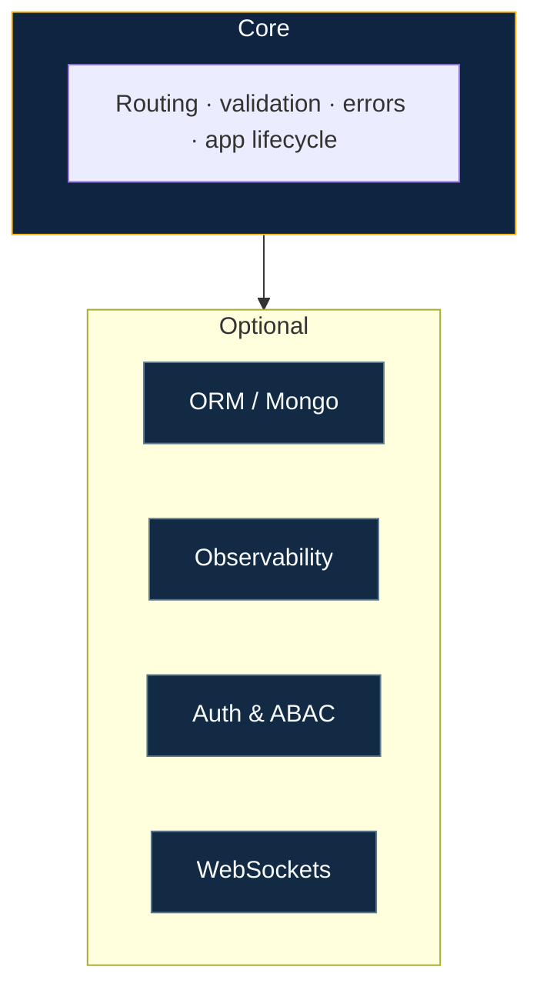
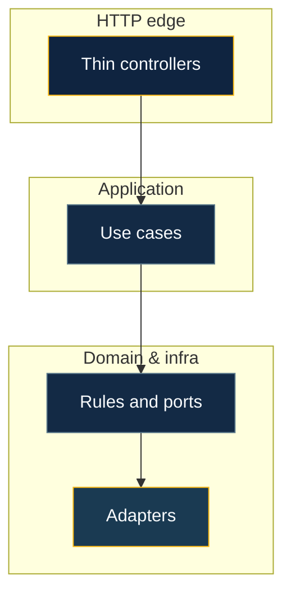

# Philosophy

BananaJS is built for teams who want **serious structure** without **enterprise bloat**. Four ideas drive the product:

**Where it sits:** a thin layer on **Express**—same Node deployment, shared patterns (decorators, errors, modules) so the team and tooling see one shape.

## AI-first

Developer productivity is not optional. The **`bjs`** CLI ships **AI-assisted** flows: generate from **OpenAPI / JSON Schema** or **natural language**, **structured review**, **wire** hints, **test** scaffolds, **`explain`**, and (on a deprecation path) **JSDoc** via **`ai doc`**. **`bjs ai setup`** writes **`.bananarc.json`**; the **`llm/`** provider layer supports **Ollama** (default), **llama.cpp**, **OpenAI**, and **Anthropic**. **`bjs ai generate --module`** produces **layered** domain, application, and infrastructure folders from a description or schema. Full index: **[AI hub](/ai/)**.

## Developer experience (DX)

**Decorators** match how you already think about HTTP. **Validation** is declarative. **Responses and errors** are typed and consistent. **OpenAPI** is generated from the same decorators you ship. **Plugins** register with a clear lifecycle; **`BananaApp.create`** handles async setup. **Testing** gets a first-class **`BananaTestApp`** path. The goal is flow: less ceremony, fewer foot-guns, faster iteration—without hiding complexity when you need control.

## Extendable by design

The core stays lean; **everything heavy is optional**. **Official plugins** (TypeORM, Mongoose, OpenTelemetry, Zod, WebSocket) implement the same **`BananaPlugin`** contract as your own code. **Auth, ABAC, tenancy, caching, metrics, uploads, rate limits**—pluggable interfaces, not locked-in implementations. You extend the framework; it does not trap you in a single database or cloud story.

## Domain-driven design

**Structure can grow with the problem** — start simple, then introduce **clear boundaries** between **domain rules**, **use cases**, and **infrastructure** when the model deserves it. Nothing about BananaJS requires a heavy ceremony up front.

**Optional depth** — A dedicated **DDD toolkit** and **layered module** scaffolding exist for teams that want **shared vocabulary** (entities, repositories, units of work) and **consistent folders**; you can adopt as much or as little as fits your codebase.

**Edges, not leaks** — **Databases and integrations** stay behind **ports and adapters**; HTTP stays thin. Deeper dive: [Domain & persistence](/guide/domain-and-persistence). Layouts and CLI: [Layered architecture](/guide/layered-architecture), [AI module generation](/tooling/ai-module-generation).

---

The stack covers security, multi-tenancy, plugins, observability, and AI-assisted CLI workflows, with **schema-driven** request validation. **[Recipes](/recipes/)** in the repository walk through PostgreSQL, MongoDB, Fastify, WebSocket, and multi-tenant setups end-to-end.
