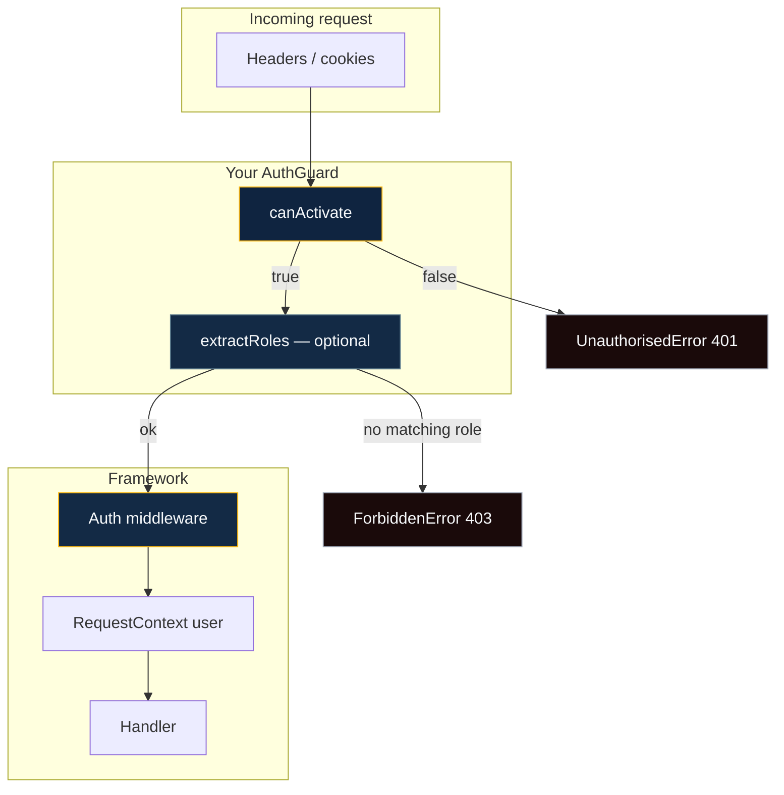

# Authentication

BananaJS does **not** ship a built-in identity provider. It ships a **small contract**: you implement an **`AuthGuard`** (and optionally **`RolesGuard`**), pass it through **`BananaAppOptions.auth`**, and mark routes with **`@Auth`**, **`@Public`**, and **`@Roles`**. The framework wires **Express middleware** in the right order and maps failures to **`401`** / **`403`** consistently.

That separation matters in production: you keep **Passport**, **JWT**, **session cookies**, **mTLS**, or **API keys** behind one guard implementation—your controllers stay declarative.

## Mental model



1. **`canActivate(req)`** — return **`true`** only when the caller is authenticated (or your policy allows the request). Return **`false`** → **`401`**.
2. **`@Roles('admin', …)`** — if present, the guard must also implement **`extractRoles(req)`** ( **`RolesGuard`** ). If any required role is missing → **`403`**. If the guard has no **`extractRoles`**, **`@Roles`** cannot be satisfied → **`403`**.
3. **`req.user`** — if you attach **`user`** on the Express request, BananaJS copies it into **`RequestContext`** for the duration of the request (async-local), so downstream code can read the same identity without threading **`req`** everywhere.

## 1. Implement a guard

Implement **`AuthGuard`** from **`@banana-universe/bananajs`**. For **`@Roles`**, add **`extractRoles`** so the same object satisfies **`RolesGuard`**.

```typescript
import type { Request } from 'express'
import type { AuthGuard, RolesGuard } from '@banana-universe/bananajs'

// Example: Bearer token present; your verify() calls your IdP or JWT library.
async function verifyBearer(req: Request): Promise<{ sub: string; roles: string[] } | null> {
  const auth = req.headers.authorization
  if (typeof auth !== 'string' || !auth.startsWith('Bearer ')) return null
  const token = auth.slice(7)
  // Replace with your real verification (jwt.verify, introspection, etc.)
  if (token.length < 10) return null
  return { sub: 'user-1', roles: ['user'] }
}

export const bearerAuthGuard: AuthGuard & RolesGuard = {
  async canActivate(req: Request): Promise<boolean> {
    const session = await verifyBearer(req)
    if (!session) return false
    ;(req as unknown as { user: unknown }).user = { id: session.sub, roles: session.roles }
    return true
  },

  async extractRoles(req: Request): Promise<string[]> {
    const u = (req as unknown as { user?: { roles?: string[] } }).user
    return u?.roles ?? []
  },
}
```

::: tip Keep secrets out of the framework
Guard code runs in **your** app; load signing keys and issuer URLs from **environment** or **`BananaConfig`**, not from the docs.
:::

## 2. Register the guard on `BananaApp`

Pass **`auth: { guard: bearerAuthGuard }`** (or your factory) in **`BananaAppOptions`**. Without **`auth.guard`**, routes decorated with **`@Auth`** log a **warning** and **do not** run auth middleware—**`@Public`** is still honored for opting out.

```typescript
import { BananaApp, defineBananaControllers } from '@banana-universe/bananajs'
import { bearerAuthGuard } from './auth/bearer-guard.js'
import { ApiController } from './Api.controller.js'

export const app = new BananaApp({
  controllers: defineBananaControllers(ApiController),
  auth: { guard: bearerAuthGuard },
  swagger: { enabled: true, title: 'API', version: '1.0.0', path: '/api-docs' },
})
```

See [**BananaAppOptions**](/reference/bananaapp-options) for the full surface area.

## 3. Decorate controllers

| Decorator                       | Scope           | Meaning                                                                                                     |
| ------------------------------- | --------------- | ----------------------------------------------------------------------------------------------------------- |
| **`@Auth()`**                   | Class or method | This route is protected; requires **`canActivate`** unless overridden.                                      |
| **`@Public()`**                 | Method          | Skip auth for this handler **even if** the class is **`@Auth`** (use for health, login callback, webhooks). |
| **`@Roles('admin', 'editor')`** | Method          | After auth, require at least one of the listed roles.                                                       |

```typescript
import { Controller, Get, Auth, Public, Roles } from '@banana-universe/bananajs'

@Controller('api')
@Auth()
export class ApiController {
  @Get('health')
  @Public()
  health() {
    return { ok: true }
  }

  @Get('profile')
  profile() {
    // user was attached in the guard and mirrored to RequestContext
    return { message: 'authenticated' }
  }

  @Get('admin')
  @Roles('admin')
  adminOnly() {
    return { role: 'admin' }
  }
}
```

## Errors and HTTP status

| Failure                               | HTTP    | Error type              |
| ------------------------------------- | ------- | ----------------------- |
| **`canActivate`** returns **`false`** | **401** | **`UnauthorisedError`** |
| **`@Roles`** not satisfied            | **403** | **`ForbiddenError`**    |

These flow through **`ErrorMiddleware`** like other **`ApiError`** subclasses.

## OpenAPI (Swagger)

When **`auth`** is set on **`BananaApp`**, the generated spec includes **`BearerAuth`** (HTTP bearer, JWT-style) and marks protected operations with **`security: [{ BearerAuth: [] }]`** (unless the handler is **`@Public`**). See **`packages/bananajs/src/lib/OpenAPI/swagger.setup.ts`**.

Install **`@scalar/express-api-reference`** or **`swagger-ui-express`** to get a UI; otherwise the JSON spec is still served at **`/api-docs.json`** (path defaults—see **`swagger`** options).

## Beyond auth: ABAC with `@Can`

If you need **resource/action** checks (e.g. “can delete **this** document”), use **`@Can(action, resource)`** and provide **`abac: { guard: AbacGuard }`** in **`BananaAppOptions`**. That runs **after** authentication. See [**Advanced concepts**](/guide/advanced-concepts) and TypeDoc for **`AbacGuard`**.

## Testing

Swap or override the guard in **`testOverrides`** on **`BananaAppOptions`** (or use **`BananaTestApp`** patterns) so tests use a **fake guard** that always returns **`true`** and sets **`req.user`** with fixture roles—no network calls.

## Related

- [Decorators — Auth & security](/reference/decorators#auth-security)
- [BananaAppOptions — `auth`](/reference/bananaapp-options#auth-docs)
- [Advanced concepts](/guide/advanced-concepts)
- TypeDoc: [`AuthGuard`](/api/interfaces/AuthGuard), [`RolesGuard`](/api/interfaces/RolesGuard)
