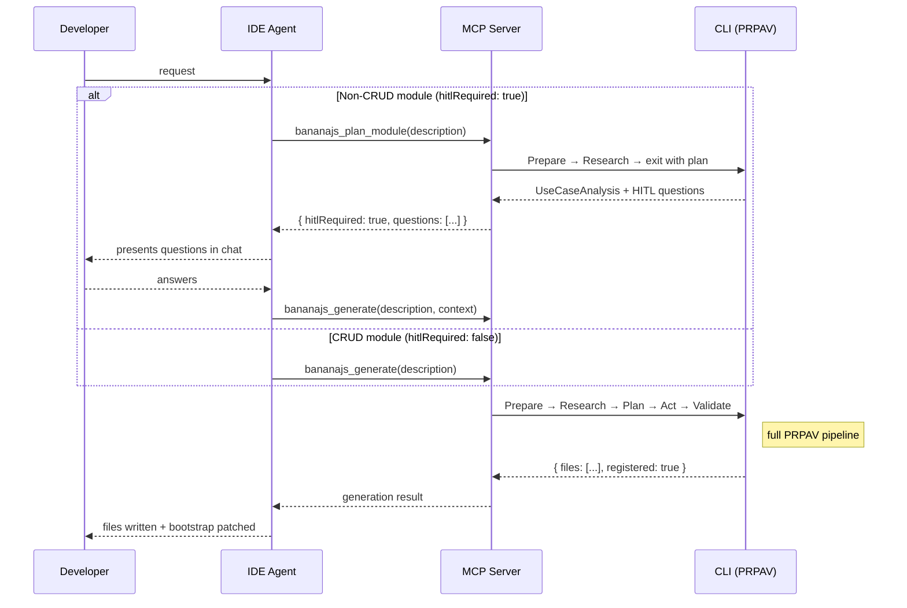

# MCP Server

`bjs mcp start` exposes the full BananaJS CLI as a **Model Context Protocol (MCP) server** — a persistent JSON-RPC process that any MCP-compatible IDE discovers automatically. Your agent sidebar gets 9 typed tools. No copy-pasting terminal commands. No context switching.

## Request flow

Each tool call routes through the CLI's PRPAV pipeline on the server side. Complex module requests use a **two-step flow** — plan first, then generate with answers — so the AI never has to guess intent.



::: tip Two-step flow for non-CRUD modules
Always call `bananajs_plan_module` first for complex requests (webhooks, sagas, integrations). It exits early after the **Research** stage and returns targeted questions. Pass the answers back via the `context` field in `bananajs_generate` — this produces domain-appropriate code instead of generic CRUD stubs.
:::

## Exposed tools

| Tool | What it does |
|------|--------------|
| `bananajs_routes` | List every registered route and its HTTP method |
| `bananajs_explain` | Return a concise LLM summary of any source file |
| `bananajs_review` | Run a structured convention review; returns `AiReviewJson` |
| `bananajs_plan_module` | Classify use case + return HITL questions before generation (call first for non-CRUD modules) |
| `bananajs_generate` | Scaffold a flat bundle or full DDD module tree; accepts `context` from `bananajs_plan_module` |
| `bananajs_mock` | Generate `build<Type>()` fixture factories from Zod schemas |
| `bananajs_debug` | Parse a stack trace into root cause + fix (`AiDebugJson`) |
| `bananajs_perf` | Static-first N+1 and performance scan |
| `bananajs_upgrade` | Upgrade readiness check — **always dry-run**, no files written |

## Finding your `bjs` binary

The MCP server runs as a **persistent process** — not a hot-reload dev server. Three ways to reference it:

| Approach | `command` | `args[0]` | When to use |
|---|---|---|---|
| **npx** (recommended) | `npx` | `-y`, `@banana-universe/bananajs-cli` | No install needed; always resolves the right version |
| **Local install** | `node` | `./node_modules/.bin/bjs` | Already in `dependencies`; fastest cold start |
| **Global install** | `bjs` | _(inline)_ | After `npm i -g @banana-universe/bananajs-cli` |

The tabs below use the **`npx`** form throughout.

## Setup per IDE

::: code-group

```json [Cursor · .mcp.json]
// File: <project-root>/.mcp.json
// Or globally: ~/.cursor/mcp.json
{
  "mcpServers": {
    "bananajs": {
      "command": "npx",
      "args": ["-y", "@banana-universe/bananajs-cli", "mcp", "start"]
    }
  }
}
```

```json [VS Code · GitHub Copilot]
// File: <project-root>/.vscode/mcp.json
// Requires VS Code ≥ 1.99 with Copilot extension
{
  "servers": {
    "bananajs": {
      "type": "stdio",
      "command": "npx",
      "args": ["-y", "@banana-universe/bananajs-cli", "mcp", "start"]
    }
  }
}
```

```json [Claude Desktop]
// macOS: ~/Library/Application Support/Claude/claude_desktop_config.json
// Windows: %APPDATA%\Claude\claude_desktop_config.json
{
  "mcpServers": {
    "bananajs": {
      "command": "npx",
      "args": ["-y", "@banana-universe/bananajs-cli", "mcp", "start"]
    }
  }
}
```

```bash [Claude Code CLI]
# One command — no config file editing needed
claude mcp add bananajs -- npx -y @banana-universe/bananajs-cli mcp start

# Verify registration
claude mcp list
```

```json [Windsurf]
// File: ~/.codeium/windsurf/mcp_server_config.json
{
  "mcpServers": {
    "bananajs": {
      "command": "npx",
      "args": ["-y", "@banana-universe/bananajs-cli", "mcp", "start"]
    }
  }
}
```

```json [OpenCode]
// File: <project-root>/opencode.json  (or ~/.config/opencode/config.json globally)
{
  "mcp": {
    "bananajs": {
      "command": "npx",
      "args": ["-y", "@banana-universe/bananajs-cli", "mcp", "start"]
    }
  }
}
```

```json [Zed]
// File: ~/.config/zed/settings.json  — merge into the existing object
{
  "context_servers": {
    "bananajs": {
      "command": {
        "path": "npx",
        "args": ["-y", "@banana-universe/bananajs-cli", "mcp", "start"]
      }
    }
  }
}
```

```json [Continue]
// File: <project-root>/.continue/config.json
{
  "mcpServers": [
    {
      "name": "bananajs",
      "command": "npx",
      "args": ["-y", "@banana-universe/bananajs-cli", "mcp", "start"]
    }
  ]
}
```

:::

::: tip Restart once, use everywhere
After saving the config, **restart the IDE** (or reload the MCP server from its settings panel). All 9 tools register automatically — no further setup needed.
:::

::: warning Working directory matters
The server resolves your project root from the directory it starts in. If your IDE launches from the wrong folder, pass `--cwd` explicitly:

```json
"args": ["-y", "@banana-universe/bananajs-cli", "mcp", "start", "--cwd", "/absolute/path/to/my-app"]
```
:::

## Use cases

<div class="mcp-use-cases">

<details class="ai-scenario ai-scenario--collapsible">
<summary><strong>Generate, review, and iterate — without leaving the chat</strong><span class="uc-tag">generate · review</span></summary>

**Scene:** You are in Cursor's agent sidebar. You type: *"Add a Payments module with Stripe webhook handling."* Files generated, wired, and reviewed in one flow — no terminal, no tab-switching.

**What happens:**

1. The agent calls `bananajs_plan_module` with your description. It returns `useCase: "webhook"`, `hitlRequired: true`, and three questions (which Stripe events to handle, whether to deduplicate by idempotency key, how to persist raw payloads).
2. The agent presents the questions in the chat. You answer: _payment_intent.succeeded, charge.failed_, _yes_, _typeorm_.
3. The agent calls `bananajs_generate` with a `context` field carrying the plan and your answers.
4. Files land in `src/modules/payment/` with webhook-appropriate code: `receiveWebhook`, `verifySignature`, `handlePaymentSucceeded`, `handleChargeFailed` — not generic CRUD stubs.
5. The agent calls `bananajs_review payment --format json` immediately.
6. Findings come back inline: one `warning` about a missing idempotency guard on retry, one `info` about raw payload size limits. You fix both in the same turn.

**Why this matters:** Three terminal commands and two file opens collapse into one conversation turn. Review findings stay in the same context as the generated code.

</details>

<details class="ai-scenario ai-scenario--collapsible">
<summary><strong>Debug a production crash in Claude Desktop</strong><span class="uc-tag">debug</span></summary>

**Scene:** Your app threw a tsyringe `Cannot inject the dependency at position #0` error. You paste the stack trace and ask: *"What is wrong and how do I fix it?"*

**What happens:**

1. Claude calls `bananajs_debug` with the stack trace text.
2. Returns `AiDebugJson`: root cause (`OrderService` missing `@injectable()`), exact file and line, one-line fix.
3. You follow up: *"Are there other modules with the same issue?"*
4. Claude calls `bananajs_review src/modules --format json`, filters by `injection` severity, lists two more candidates.

**Why this matters:** Stack-trace triage takes under a minute. The agent retains context across tool calls, so follow-ups cost nothing.

</details>

<details class="ai-scenario ai-scenario--collapsible">
<summary><strong>Pre-PR performance scan from the sidebar</strong><span class="uc-tag">perf</span></summary>

**Scene:** You finished a new Orders service. Before the PR you want to catch N+1 queries — without a terminal.

**What happens:**

1. You type: *"Run a performance scan on the orders module."*
2. Agent calls `bananajs_perf` with `module: "src/modules/orders"` and `format: "json"`.
3. Two N+1 findings in `OrderService.findAll`, one missing `.lean()` — each with file and line.
4. You ask: *"Fix the N+1 in findAll."* Agent applies the eager-load fix and reruns `bananajs_perf` to confirm clean output.

**Why this matters:** Static scan — no LLM required, instant, free. Catches it before code review.

</details>

<details class="ai-scenario ai-scenario--collapsible">
<summary><strong>Explore live routes without opening any file</strong><span class="uc-tag">routes</span></summary>

**Scene:** You joined a project mid-sprint and want to know what HTTP endpoints exist and which module owns each one.

**What happens:**

1. You type: *"What routes does this app expose?"*
2. Agent calls `bananajs_routes` with no arguments.
3. Returns method, path, controller class, and handler method for every registered route.
4. You follow up: *"Which of these don't have authentication middleware?"* The agent flags the unguarded ones.

**Why this matters:** Reflects the actual registered state of the app — not just what's in source files. Best orienteering tool when joining a project.

</details>

<details class="ai-scenario ai-scenario--collapsible">
<summary><strong>Generate test fixtures mid-test</strong><span class="uc-tag">mock</span></summary>

**Scene:** Writing a unit test for `CreateOrderUseCase` and need a realistic `CreateOrderDto` — no hand-coded literals, no `TODO`.

**What happens:**

1. You type: *"Generate fixture factories for the orders module."*
2. Agent calls `bananajs_mock` with `module: "src/modules/orders"`.
3. `__fixtures__/create-order.dto.fixtures.ts` written alongside the module with `buildCreateOrderDto(overrides?)`.
4. Import it at the top of your test — one line — override only what the test needs.

**Why this matters:** Factories stay in sync with your Zod schema on the next `bjs ai mock` run. No stale literals, no type errors three sprints later.

</details>

</div>

## Security model

`bananajs_upgrade` **always** appends `--dry-run` — the tool never rewrites files without an explicit follow-up command from you. All other write operations (generate, mock) require you to confirm the output path. Read-only tools (routes, explain, review, perf, debug) have no side effects.

## Read next

- [AI overview](/ai/) — the full `bjs ai` command surface
- [AI commands reference](/tooling/ai-commands) — every flag, alias, and CI example
- [CLI reference — `bjs mcp`](/tooling/cli#bjs-mcp)
