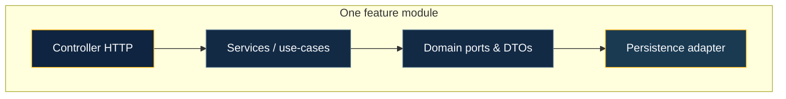

# Recipes

Most framework docs tell you _how_ to wire a single endpoint. **Recipes** are the opposite: they are **runnable stories**—whole applications in this repo that you can **run**, **read end-to-end**, and **steal from** when your own service needs the same shape of problem.

Each recipe is a **vertical slice**: HTTP surface, application services, and persistence (or transport) live under one roof, usually as **`src/modules/<feature>/`**. Nothing is a throwaway “hello world”; the layout is the same layout you would defend in a design review—just smaller.

## Why this exists

BananaJS is opinionated about **structure** (decorators, Zod, `SuccessResponse`, modules with **tsyringe**). Recipes show what that structure **feels like** when the domain is real enough to need **auth**, **pagination**, **two databases**, or **WebSockets**—without hiding the boring parts (env files, Docker, lint, CLI).

If [Getting started](/guide/getting-started) gets you a blank canvas, recipes are **finished sketches** you trace.

## How to pick a recipe

Ask what you are trying to **prove** first—not which database you like on paper.

| If you want to…                                                                              | Start with                                                                                                       |
| -------------------------------------------------------------------------------------------- | ---------------------------------------------------------------------------------------------------------------- |
| Ship a **relational** API with layered modules, auth, and optional traces                    | [example-rest-postgresql](https://github.com/surya-manne/banana-universe/tree/main/apps/example-rest-postgresql) |
| Prefer **MongoDB** and Mongoose with Zod on the wire                                         | [example-rest-mongodb](https://github.com/surya-manne/banana-universe/tree/main/apps/example-rest-mongodb)       |
| See **TypeORM and Mongoose in one process** without blending concerns—**one ORM per module** | [example-rest-dual-orm](https://github.com/surya-manne/banana-universe/tree/main/apps/example-rest-dual-orm)     |
| Run **Fastify** next to Express or explore a hybrid HTTP stack                               | [example-fastify](https://github.com/surya-manne/banana-universe/tree/main/apps/example-fastify)                 |
| Add **WebSockets** beside REST                                                               | [example-websocket-chat](https://github.com/surya-manne/banana-universe/tree/main/apps/example-websocket-chat)   |
| Model **multi-tenancy** and **ABAC-style** authorization (`@Can`)                            | [example-multitenant](https://github.com/surya-manne/banana-universe/tree/main/apps/example-multitenant)         |

Everything in the table below links to the same apps with a bit more detail.

## Soft architecture: what stays stable

Recipes are not identical, but they **rhyme**. That is intentional: your team should recognize the **same moves** in every app.

- **Modules, not loose controllers** — Prefer **`defineBananaAppOptions({ modules: [...] })`** and **`createModule`** so each feature brings its own **tsyringe** child container. A flat **`controllers`** list still works for small apps; recipes lean toward **modules** because that is where the framework’s **enterprise-shaped** DX pays off. See [Layered architecture](/guide/layered-architecture) and [Domain & persistence](/guide/domain-and-persistence) for how slices meet storage.
- **One HTTP class per module** — Split modules if the API surface forks (e.g. public vs admin); don’t grow a “god controller.”
- **Validation at the edge** — `@Body`, `@Params`, `@Query`, `@Headers` with **Zod** keep failures **400** and predictable.
- **Cross-cutting concerns** — Auth guards, tenancy, and OpenAPI sit in **options** and **decorators** (`@Auth`, `@Public`, `@Roles`, `@Can`); see [Authentication](/integrations/auth) when you wire identity.

::: tip Greenfield vs exploration
Use **`bananajs new`** ([Getting started](/guide/getting-started)) to **generate** a matching layout. Use **recipes** when you want to **read** a full repo layout that already made the decisions.
:::

## Conventions (shared across recipes)

- **Layout** — `src/modules/<feature>/` per vertical slice: controller, DTOs, services, infrastructure. **Dotted role names** for feature files (e.g. `Catalog.controller.ts`, `CatalogItem.entity.ts`, `Article.service.ts`); keep **`main.ts`**, **`bootstrap.ts`**, and barrel **`index.ts`** in **lowercase**. In **`createModule`**, list only **non-controller** providers—the **`controller`** field registers the HTTP class; **do not** duplicate it in **`providers`**. Domain persistence contracts use **`domain/<Entity>.mapper.ts`** (repository port) or **`domain/<Entity>.repository.ts`**; combine list/query Zod shapes into the feature **`*.dto.ts`** instead of scattering one-off query files.
- **Shared code** — Cross-cutting helpers under `src/lib/` (e.g. `BearerAuthGuard.ts`).
- **Environment** — Copy `.env.example` → `.env`; entry loads **`dotenv`** (`import 'dotenv/config'` in `main.ts`).
- **Development** — `npm run dev` uses **`tsx watch`**; `npm run build` / `npm start` for production-style runs.
- **Quality** — ESLint 9 (type-aware TypeScript) + Prettier; `npm run lint`, `npm run format`. CLI-generated apps align with **Prettier** tab width **4**, **`.editorconfig`**, and optional Swagger at **`/api-docs`** (see [Getting started](/guide/getting-started)).
- **CLI** — `@banana-universe/bananajs-cli` as a devDependency (`bananajs`, `bjs`).

## Catalog

| Recipe                                                                                                           | Stack             | What it demonstrates                                                             |
| ---------------------------------------------------------------------------------------------------------------- | ----------------- | -------------------------------------------------------------------------------- |
| [example-rest-postgresql](https://github.com/surya-manne/banana-universe/tree/main/apps/example-rest-postgresql) | SQL (PostgreSQL)  | Layered `modules/catalog`, auth, pagination, optional observability, API docs    |
| [example-rest-mongodb](https://github.com/surya-manne/banana-universe/tree/main/apps/example-rest-mongodb)       | MongoDB           | `modules/articles`, Mongoose + `@Body(Zod)` (see app README for deployment)      |
| [example-rest-dual-orm](https://github.com/surya-manne/banana-universe/tree/main/apps/example-rest-dual-orm)     | SQL + MongoDB     | **One ORM per module**: `widgets` (TypeORM), `tags` (Mongoose); shared bootstrap |
| [example-fastify](https://github.com/surya-manne/banana-universe/tree/main/apps/example-fastify)                 | Fastify + Express | `modules/health`, hybrid HTTP via `@fastify/express`                             |
| [example-websocket-chat](https://github.com/surya-manne/banana-universe/tree/main/apps/example-websocket-chat)   | WebSockets        | `modules/health` + `modules/chat`, WebSocket plugin alongside HTTP               |
| [example-multitenant](https://github.com/surya-manne/banana-universe/tree/main/apps/example-multitenant)         | SQL + tenancy     | `modules/note`, per-tenant data and `@Can` ABAC-style checks                     |

Each recipe ships with a **`README.md`**, **`.env.example`** where it matters, and **`docker-compose.yml`** when a database (or similar) is part of the story.

## Where to go next

- [Philosophy](/guide/philosophy) — why BananaJS optimizes for clarity and AI-friendly structure
- [Layered architecture](/guide/layered-architecture) — how slices map to layers
- [Integrations](/integrations/typeorm) — ORMs, validation, auth, observability
- [Tooling](/tooling/cli) — **`bananajs`** / **`bjs`** commands that recipes already include
