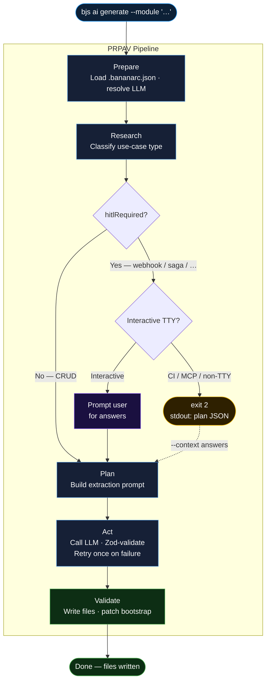
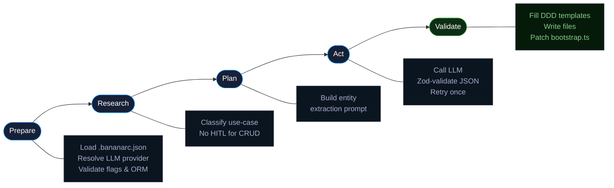

# AI module generation

Start with the **[AI hub](/ai/)** if you want the guided story; **this page is the deep dive** into **`bjs ai generate --module`**: use-case analysis, HITL questioning, extraction, templates, and flags.

It covers **`bjs ai setup`**, **`.bananarc.json`**, and **`bjs ai generate --module`** — offline-first LLM providers (Ollama default) plus optional cloud models, and a five-stage **Prepare → Research → Plan → Act → Validate** pipeline with optional HITL questioning for complex use-cases.

## Prerequisites

- **BananaJS CLI** (`@banana-universe/bananajs-cli`) installed in your project or globally.
- For **local** generation: [Ollama](https://ollama.com) running (`ollama serve`) and a model pulled (e.g. `ollama pull llama3.2`).
- Optional: **`zod`** for JSON validation of the extraction step (recommended; listed as an optional peer of the CLI).

## 1. Configure the CLI: `bjs ai setup`

Run from your app root:

```bash
npx @banana-universe/bananajs-cli ai setup
```

The wizard lets you pick:

| Provider      | Notes                                                                       |
| ------------- | --------------------------------------------------------------------------- |
| **Ollama**    | Default; no API keys; uses `llm.baseUrl` (default `http://localhost:11434`) |
| **llama.cpp** | HTTP server mode (e.g. `/completion` on port 8080)                          |
| **OpenAI**    | Requires `OPENAI_API_KEY`                                                   |
| **Anthropic** | Requires `ANTHROPIC_API_KEY`                                                |

The command writes **`.bananarc.json`** at the project root, for example:

```json
{
  "llm": {
    "provider": "ollama",
    "model": "llama3.2",
    "baseUrl": "http://localhost:11434",
    "retries": 2,
    "timeoutMs": 30000
  },
  "generate": {
    "defaultOrm": "typeorm",
    "outDir": "./src"
  }
}
```

`.bananarc.json` is the **general BananaJS project config**: the `llm` block holds provider settings; `generate` holds defaults for `bjs ai generate --module` (ORM and output directory).

## 2. Generate a full DDD module

### Use-case analysis and HITL

Before generating any files the CLI runs a **use-case classification step** — the **Research** stage of the [PRPAV pipeline](/tooling/ai-commands#prpav-pipeline). It analyses your description and determines:

- What kind of module this is (`crud`, `webhook`, `event-processor`, `integration`, `query-service`, `saga`, `auth`, `hybrid`).
- Which operations the module must expose.
- Whether **Human-In-The-Loop (HITL) questions** are needed before code can be generated correctly.



For simple CRUD entities the CLI proceeds automatically. For anything more complex — such as a Stripe webhook handler — it prompts you for answers before generating domain-appropriate code.

**Interactive (TTY) example:**

```
$ npx bjs ai generate --module "Payments module with Stripe webhook handling"

Analysing use-case…

Use-case identified: This is a Stripe webhook handler that receives, verifies, and processes
payment events. It requires signature verification, idempotency handling, and event routing.

Before generating code, please answer these questions: (press Enter to accept the default)

? Which Stripe webhook events should this module handle? (e.g. payment_intent.succeeded,
  charge.failed, subscription.updated) [default: payment_intent.succeeded, charge.failed]
> payment_intent.succeeded, charge.failed, subscription.updated

? Should received events be deduplicated using Stripe's idempotency key?
  [default: yes]
> yes

? Should webhook events be persisted to the database before processing?
  [default: yes, typeorm]
> yes, typeorm

✔ Generating Payment module…
Created: src/modules/payment/domain/Payment.entity.ts
Created: src/modules/payment/application/PaymentService.ts
…
```

### From natural language

```bash
npx @banana-universe/bananajs-cli ai generate --module "Product catalog with name, price, category, and stock quantity"
```

The CLI runs the five-stage pipeline:

1. **Prepare** — loads `.bananarc.json`, resolves the LLM provider, and validates the `--orm` flag.
2. **Research** — analyses the use-case; classifies as `crud`; no HITL questions needed for a straightforward entity.
3. **Plan** — builds the strict JSON extraction prompt (entity name + fields).
4. **Act** — calls the configured LLM; parses and validates the response with **Zod** (`EntityExtractionSchema`). On failure it retries once, then exits with a clear error (use **`--debug`** to print raw LLM output and per-stage timings).
5. **Validate** — fills **embedded templates** for the standard DDD layout: `domain/`, `application/`, `infrastructure/`, and **`<Name>.controller.ts`** at the feature root (same **dotted filenames** as **`bjs generate module`** — see [Layered architecture](/guide/layered-architecture)). Writes files and patches bootstrap.



### Plan-only mode (non-interactive / CI / MCP)

Use **`--plan-only`** to run only the use-case analysis step without writing files. The output is a JSON object you can inspect, store, and later pass back with answers:

```bash
npx bjs ai generate --module "Payments module with Stripe webhook handling" --plan-only
```

```json
{
  "useCase": "webhook",
  "entityName": "Payment",
  "hitlRequired": true,
  "summary": "This is a Stripe webhook handler that receives, verifies, and processes payment events.",
  "operations": ["receiveWebhook", "verifySignature", "handlePaymentSucceeded", "handleChargeFailed"],
  "questions": [
    {
      "id": "events",
      "question": "Which Stripe webhook events should this module handle?",
      "required": true,
      "default": "payment_intent.succeeded, charge.failed"
    },
    {
      "id": "idempotency",
      "question": "Should received events be deduplicated using Stripe's idempotency key?",
      "required": false,
      "default": "yes"
    }
  ]
}
```

Then generate with answers via **`--context`**:

```bash
npx bjs ai generate --module "Payments module with Stripe webhook handling" \
  --context '{"analysis": <plan-output>, "answers": {"events": "payment_intent.succeeded, charge.failed", "idempotency": "yes"}}'
```

### From JSON Schema or OpenAPI

Use **`--module`** together with **`--from-schema`** so the schema drives the entity shape (no LLM extraction step):

```bash
npx @banana-universe/bananajs-cli ai generate --module --from-schema ./openapi/product.yaml
```

You can pass a bare **`--module`** flag when only the schema is needed (the description is optional if the schema is present).

### ORM and output

| Option           | Purpose                                                                             |
| ---------------- | ----------------------------------------------------------------------------------- |
| **`--orm`**      | `typeorm` \| `mongoose` \| `none` (overrides `generate.defaultOrm`)                 |
| **`--out`**      | Base directory for generated files (default: `generate.outDir` in `.bananarc.json`) |
| **`--dry-run`**  | Print files without writing                                                         |
| **`--plan-only`**| Emit use-case analysis JSON and HITL questions; do not generate files               |
| **`--context`**  | JSON-serialised `UseCaseContext` with answers; drives domain-appropriate generation |
| **`--detailed`** | Optional second LLM pass to expand application service bodies                       |
| **`--debug`**    | Log raw extraction output and validation retries                                    |

After a successful write (not **`--dry-run`**), the CLI registers the module in **`defineBananaAppOptions({ modules: [...] })`** when it finds **`src/bootstrap.ts`** (or another **`src/**/\*.ts`** with **`modules:`**), and adds **`<Name>OrmEntity`** to **`entities: [...]`** for TypeORM when possible. To generate files **without** touching bootstrap, use **`bjs generate module`** with **`--skip-bootstrap`** instead ([CLI reference](/tooling/cli#bjs-generate-type-name-alias-g)).

## 3. Via the MCP server

When using the BananaJS MCP server from an IDE agent (Claude Code, Cursor, GitHub Copilot Workspace), use the **two-step generation flow** for non-trivial modules:

**Step 1 — Plan (always call first for non-CRUD modules):**

```json
{ "tool": "bananajs_plan_module", "description": "Payments module with Stripe webhook handling" }
```

Returns the use-case analysis including `hitlRequired` and `questions`.

**Step 2 — Generate (after collecting answers):**

```json
{
  "tool": "bananajs_generate",
  "description": "Payments module with Stripe webhook handling",
  "context": "{\"analysis\": <plan output>, \"answers\": {\"events\": \"payment_intent.succeeded\", \"idempotency\": \"yes\"}}"
}
```

For simple CRUD modules (where `hitlRequired: false`), you can call `bananajs_generate` directly without planning.

## 4. Flat scaffold (unchanged)

Without **`--module`**, behavior stays as before:

- **`--from-schema`** — deterministic flat controller + DTO + service (no DDD folders).
- **`--from-prompt`** — same three **flat** files via the configured LLM (not only OpenAI).

## 5. Error messages and tuning

- **Ollama unreachable** — ensure Ollama is running (`ollama serve`).
- **Unparseable JSON** — use **`--debug`**; increase **`llm.retries`** or **`llm.timeoutMs`** in `.bananarc.json` if the model is slow.
- **Timeouts** — see `llm.timeoutMs` (default 30s).
- **Exit code 2** — HITL required in non-interactive mode; the `stdout` contains the plan JSON. Pass it back via `--context` with answers.

## See also

- [CLI reference](/tooling/cli)
- [AI commands overview](/tooling/ai-commands)
- [Layered architecture (DDD)](/guide/layered-architecture)


## Prerequisites

- **BananaJS CLI** (`@banana-universe/bananajs-cli`) installed in your project or globally.
- For **local** generation: [Ollama](https://ollama.com) running (`ollama serve`) and a model pulled (e.g. `ollama pull llama3.2`).
- Optional: **`zod`** for JSON validation of the extraction step (recommended; listed as an optional peer of the CLI).

## 1. Configure the CLI: `bjs ai setup`

Run from your app root:

```bash
npx @banana-universe/bananajs-cli ai setup
```

The wizard lets you pick:

| Provider      | Notes                                                                       |
| ------------- | --------------------------------------------------------------------------- |
| **Ollama**    | Default; no API keys; uses `llm.baseUrl` (default `http://localhost:11434`) |
| **llama.cpp** | HTTP server mode (e.g. `/completion` on port 8080)                          |
| **OpenAI**    | Requires `OPENAI_API_KEY`                                                   |
| **Anthropic** | Requires `ANTHROPIC_API_KEY`                                                |

The command writes **`.bananarc.json`** at the project root, for example:

```json
{
  "llm": {
    "provider": "ollama",
    "model": "llama3.2",
    "baseUrl": "http://localhost:11434",
    "retries": 2,
    "timeoutMs": 30000
  },
  "generate": {
    "defaultOrm": "typeorm",
    "outDir": "./src"
  }
}
```

`.bananarc.json` is the **general BananaJS project config**: the `llm` block holds provider settings; `generate` holds defaults for `bjs ai generate --module` (ORM and output directory).

## 2. Generate a full DDD module

### From natural language

```bash
npx @banana-universe/bananajs-cli ai generate --module "Product catalog with name, price, category, and stock quantity"
```

The CLI:

1. Calls the configured LLM with a **strict JSON extraction** prompt (entity name + fields).
2. Parses and validates the response with **Zod** (`EntityExtractionSchema`); on failure it **retries once** (then exits with a clear error; use **`--debug`** to print raw LLM output).
3. Fills **embedded templates** for the standard DDD layout: `domain/`, `application/`, `infrastructure/`, and **`<Name>.controller.ts`** at the feature root (same **dotted filenames** as **`bjs generate module`** — see [Layered architecture](/guide/layered-architecture)).

### From JSON Schema or OpenAPI

Use **`--module`** together with **`--from-schema`** so the schema drives the entity shape (no LLM extraction step):

```bash
npx @banana-universe/bananajs-cli ai generate --module --from-schema ./openapi/product.yaml
```

You can pass a bare **`--module`** flag when only the schema is needed (the description is optional if the schema is present).

### ORM and output

| Option           | Purpose                                                                             |
| ---------------- | ----------------------------------------------------------------------------------- |
| **`--orm`**      | `typeorm` \| `mongoose` \| `none` (overrides `generate.defaultOrm`)                 |
| **`--out`**      | Base directory for generated files (default: `generate.outDir` in `.bananarc.json`) |
| **`--dry-run`**  | Print files without writing                                                         |
| **`--detailed`** | Optional second LLM pass to expand application service bodies                       |
| **`--debug`**    | Log raw extraction output and validation retries                                    |

After a successful write (not **`--dry-run`**), the CLI registers the module in **`defineBananaAppOptions({ modules: [...] })`** when it finds **`src/bootstrap.ts`** (or another **`src/**/\*.ts`** with **`modules:`**), and adds **`<Name>OrmEntity`** to **`entities: [...]`** for TypeORM when possible. To generate files **without** touching bootstrap, use **`bjs generate module`** with **`--skip-bootstrap`\*\* instead ([CLI reference](/tooling/cli#bjs-generate-type-name-alias-g)).

## 3. Flat scaffold (unchanged)

Without **`--module`**, behavior stays as before:

- **`--from-schema`** — deterministic flat controller + DTO + service (no DDD folders).
- **`--from-prompt`** — same three **flat** files via the configured LLM (not only OpenAI).

## 4. Error messages and tuning

- **Ollama unreachable** — ensure Ollama is running (`ollama serve`).
- **Unparseable JSON** — use **`--debug`**; increase **`llm.retries`** or **`llm.timeoutMs`** in `.bananarc.json` if the model is slow.
- **Timeouts** — see `llm.timeoutMs` (default 30s).

## See also

- [CLI reference](/tooling/cli)
- [AI commands overview](/tooling/ai-commands)
- [Layered architecture (DDD)](/guide/layered-architecture)
