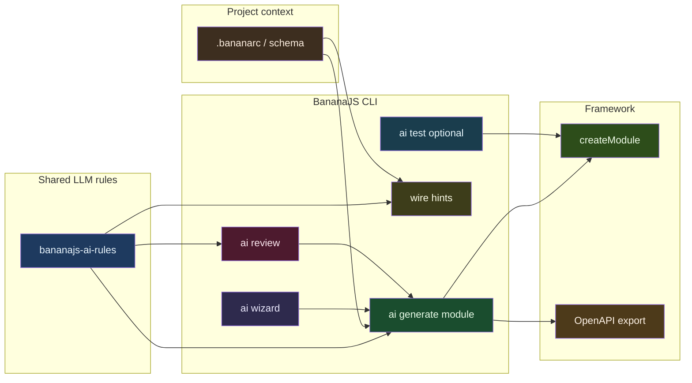

# BananaJS: AI-first and DX-friendly roadmap

This plan is the canonical AI roadmap. It subsumes the intent of [AIRoadmapV3ArchitectReviewed.md](AIRoadmapV3ArchitectReviewed.md) (architect validation, risks, sequencing, acceptance notes).

## Where things stand today

- **Strong:** `[bananajs ai generate](packages/bananajs-cli/src/index.ts)` supports **flat** codegen (`--from-schema` / `--from-prompt`) and **full DDD-style modules** via `--module` with `[ai-module.ts](packages/bananajs-cli/src/lib/ai-module.ts)` + `[generate-ai-module.ts](packages/bananajs-cli/src/lib/generate-ai-module.ts)` — schema-first extraction avoids LLM when possible; `[--detailed](packages/bananajs-cli/src/lib/ai-module.ts)` adds a second LLM pass for bodies.
- **LLM plumbing:** `[.bananarc.json](packages/bananajs-cli)` + `[ai setup](packages/bananajs-cli/src/lib/ai-setup.ts)`, providers under `[packages/bananajs-cli/src/lib/llm/](packages/bananajs-cli/src/lib/llm/)` (Ollama default, optional cloud via Vercel AI SDK).
- **Gap:** Prompts are **operation-specific** without a single **versioned BananaJS contract** (layout, naming, security, ORM boundaries) prepended to every LLM call — generation, review, and future wiring should share one source of truth.
- **Gap:** Today’s examples are **single-ORM** (`[example-rest-postgresql](apps/example-rest-postgresql)`, `[example-rest-mongodb](apps/example-rest-mongodb)`). There is **no reference project where both Mongoose and TypeORM coexist**, which matters for AI rubrics (“which stack does this module use?”) and for real polyglot backends.
- **Weaker DX:** `[ai doc](packages/bananajs-cli/src/lib/ai.ts)` rewrites controllers with JSDoc only; `[ai review](packages/bananajs-cli/src/lib/ai.ts)` is a **single controller**, **unstructured prose**, no severity, no machine output, no fix loop.

Docs already claim “AI is a primary axis” (`[docs-site/tooling/ai-commands.md](docs-site/tooling/ai-commands.md)`); the roadmap below aligns implementation with that promise.

---

## Shared LLM rules and templates (foundation for all AI CLI operations)

**Goal:** Every LLM-backed operation — **module generation** (extraction + `--detailed`), **code review**, **wiring hints**, and later **test scaffolds** — consumes the **same canonical rules** so behavior stays consistent and upgradable.

| Deliverable               | Purpose                                                                                                                                                                                                                                                                                                                                                                                                                                                                                                                                                                                                                                       |
| ------------------------- | --------------------------------------------------------------------------------------------------------------------------------------------------------------------------------------------------------------------------------------------------------------------------------------------------------------------------------------------------------------------------------------------------------------------------------------------------------------------------------------------------------------------------------------------------------------------------------------------------------------------------------------------- |
| **Single rules artifact** | One (or layered) document under e.g. `[packages/bananajs-cli/src/lib/llm/](packages/bananajs-cli/src/lib/llm/)` — e.g. `bananajs-ai-rules.md` or `rules/` fragments — committed, versioned with the CLI.                                                                                                                                                                                                                                                                                                                                                                                                                                      |
| **Content**               | **Module layout** (align [EnterpriseRoadmapV6.md](plans/EnterpriseRoadmapV6.md): `src/modules/<feature>/`, `domain/` + `persistence/`, `createModule`, tokens next to ports); **ORM boundaries** (TypeORM entity vs Mongoose model naming; one ORM per feature by default); **HTTP** (controllers, Zod/DTO, `SuccessResponse` / `ApiError`); **security** (validation, no raw secrets; **forbid echoing env secrets**; `[REDACTED]` patterns for logs/CI); **wiring** (how modules register in bootstrap; **plugins before module providers**; **URI-first** / `apiPrefix` where relevant); **review severity** vocabulary (info/warn/error). |
| **Composition**           | Operation-specific prompts in `[lib/llm/prompts/](packages/bananajs-cli/src/lib/llm/prompts/)` **prepend or inject** the shared rules (system message or clear `--- RULES ---` block) so `generate`, `review`, and `wire` never drift.                                                                                                                                                                                                                                                                                                                                                                                                        |
| **Testing**               | Snapshot or **contract tests** that the bundled rules string is non-empty and includes key section headers (module layout, ORM boundaries, security) — low cost, high regression signal.                                                                                                                                                                                                                                                                                                                                                                                                                                                      |

Generate and review prompts should reference **supported** bootstrap paths from [docs/ARCHITECTURE.md](../docs/ARCHITECTURE.md): **`controllers`** vs **`modules`** and when each applies.

This is **not** IDE-specific; it is the **CLI’s** contract for any provider (Ollama, cloud).

---

## Project context schema (`.bananarc` / sibling)

**Goal:** Extend `.bananarc.json` (or a sibling file) with **module layout version**, **ORM default**, **`apiPrefix`**, and optional **paths to bootstrap** so generation can **suggest or apply** import wiring instead of dropping files in `src/`.

**Architect note:** This is a **named deliverable**, not an implicit stretch goal. **`--wire` and bootstrap hints depend on it** — without canonical fields for bootstrap paths and layout version, wire stays weak. Implement **minimal schema + documentation** early (Horizon A if wire lands in B).

---

## Dual-ORM reference application (new)

**Goal:** Add an `**apps/`** example (name TBD, e.g. `example-rest-dual-orm` or `example-polyglot`) where **both** TypeORM and Mongoose are initialized and **at least one module uses each stack\*\* — e.g. one feature folder SQL-backed, another Mongo-backed, shared `bootstrap.ts` / `main.ts` patterns.

| Why                   | Details                                                                                                                                                                                                                           |
| --------------------- | --------------------------------------------------------------------------------------------------------------------------------------------------------------------------------------------------------------------------------- |
| **AI rubric**         | Review and codegen prompts can cite **real** import patterns, plugin order, and env split (`DATABASE_URL` vs `MONGODB_URI`).                                                                                                      |
| **Recipes as rubric** | Replaces “imagine two separate apps” with **one** codebase showing coexistence — closer to brownfield reality.                                                                                                                    |
| **Docs**              | docs-site “recipes” + CLI help can point here; document **supported matrix** in README.                                                                                                                                           |
| **Maintenance**       | Two ORMs ⇒ dependency churn — **pin versions**; add minimal **CI smoke** (bootstrap + health). **Parallel track with rules** is OK if the example only **consumes public plugin APIs** (avoid coupling to private CLI internals). |

**Scope note:** Small enough to maintain: two slim modules (not full domains), health checks, clear README explaining **when** to add which ORM plugin. **One ORM per feature** by default; dual-ORM app is **two features**, not one feature with two ORMs.

---

## Gaps and risks (from architect review)

| Risk                                             | Severity | Mitigation                                                                                                                             |
| ------------------------------------------------ | -------- | -------------------------------------------------------------------------------------------------------------------------------------- |
| **Review JSON without a `schemaVersion`**        | Medium   | Every structured output carries **`schemaVersion`** (semver or integer); CLI documents breaking changes.                               |
| **Wire hints without canonical project context** | High     | Wire depends on **bananarc** (or sibling) fields for bootstrap paths and module layout version — see **Project context schema** above. |
| **Dual-ORM app maintenance**                     | Medium   | Pin versions; CI smoke; **supported matrix** in README.                                                                                |
| **LLM rules and secrets**                        | High     | Rules **forbid** echoing env secrets; document redaction; align with team guardrails for logs and CI.                                  |
| **`--fix` auto-fix**                             | Medium   | Scope to **safe transforms** only; ambiguous cases emit `.patch` or suggestions; **never** silent rewrite of business logic.           |
| **SARIF mapping cost**                           | Low      | Optional in Horizon A; map internal JSON → SARIF in a **single adapter** so core review stays schema-stable.                           |

---

## Principles (what “AI-first” means for BananaJS)

1. **CLI as the agent’s contract** — Outputs should be **predictable** (templates + JSON sidecars), **diffable**, and **replayable** (same schema → same tree). LLM fills gaps; deterministic code wins when possible (already true for `--from-schema` DDD path).
2. **Project context is first-class** — See **Project context schema**; generation and wire validate against it when present.
3. **Shared rules for every LLM call** — See **Shared LLM rules and templates**; no ad-hoc one-off system prompts without importing the standard.
4. **Action over commentary** — Prefer **structured findings**, **patches**, and **scaffolded tests** over long narrative reviews or JSDoc-only doc pass.
5. **Progressive disclosure** — Power users keep flags; newcomers get `**bananajs ai` wizard (mirror `[new` + inquirer](packages/bananajs-cli/src/index.ts)) for “describe feature → preview → write”.

**First vertical slice (architect recommendation):** Inject **shared LLM rules** into **generate** and **review** before building wizard UX, so the wizard does not hard-code divergent prompts.

---

## Roadmap by horizon

### Horizon A (0–1 release cycles): foundation + obvious wins

| Direction                | Proposal                                                                                                                                                                                                                                                                          |
| ------------------------ | --------------------------------------------------------------------------------------------------------------------------------------------------------------------------------------------------------------------------------------------------------------------------------- |
| **LLM rules**            | Implement **shared rules artifact** + wire into **generate** (extraction/`--detailed`), **review**, and **wire** prompts (`[lib/llm/prompts/](packages/bananajs-cli/src/lib/llm/prompts/)`).                                                                                      |
| **Project context**      | **Minimal `.bananarc` (or sibling) schema** + docs — early if **wire** is targeted for B.                                                                                                                                                                                         |
| **Dual-ORM app**         | Add **example app with Mongoose + TypeORM** (see above); link from docs and from internal “golden” rubric text in rules; CI smoke.                                                                                                                                                |
| **Module generation UX** | Add `**bananajs ai wizard` (or default interactive mode when TTY): entity → schema or text → ORM/preset → preview → confirm; **flags preserved for CI**.                                                                                                                          |
| **Review**               | Structured output (**JSON** with **`schemaVersion`** + human summary); **`--format json`**, optional **`--sarif`** (via adapter); **`--module <path>`** scope. **Publish** minimal JSON schema or TypeScript type **in-repo** under `packages/bananajs-cli` for consumers and CI. |
| **Review fix loop**      | **`--fix`**: safe auto-fixes only; else `.patch` or suggestions for manual apply.                                                                                                                                                                                                 |
| **Doc command**          | **Deprecate-with-timeline** (docs-site); prefer **API slice Markdown** over JSDoc injection; point to OpenAPI + structured review.                                                                                                                                                |

### Horizon B (2–3 cycles): AI that understands this repo

| Direction             | Proposal                                                                                                                                                                                              |
| --------------------- | ----------------------------------------------------------------------------------------------------------------------------------------------------------------------------------------------------- |
| **Auto-wiring**       | `**--wire`** or follow-up command: detect `bootstrap.ts` / `main.ts`, suggest imports + `modules: [...]`; **dry-run default**; rules include **wiring conventions**; **validate against bananarc\*\*. |
| **Recipes as rubric** | Embedded golden patterns from **dual-ORM app** + existing single-ORM examples; review prompt references **shared LLM rules** + recipe snippets.                                                       |
| **Tests**             | `**bananajs ai test` — supertest skeleton via `BananaTestApp` (align tokens/overrides with Enterprise testing story when extended).                                                                   |
| **Explain**           | `**bananajs ai explain <file>` — short module summary for humans / PR descriptions (no IDE-specific wording).                                                                                         |

### Horizon C (strategic): docs + OpenAPI loop

| Direction          | Proposal                                                                                                                                                                                  |
| ------------------ | ----------------------------------------------------------------------------------------------------------------------------------------------------------------------------------------- |
| **Docs + codegen** | Tie `**openapi export` (`[openapi.ts](packages/bananajs-cli/src/lib/openapi.ts)`) to documented recipes (client/tests from spec).                                                         |
| **AI docs hub**    | **Dedicated docs-site AI section** (see [Docs-site: dedicated AI section](#docs-site-dedicated-ai-section-capstone)); full index of AI features + links; final consolidation as capstone. |

### Deferred (late — explicit backlog)

Do **not** schedule in Horizons A–C; add when the core CLI AI story is stable.

| Item                               | Notes                                                                             |
| ---------------------------------- | --------------------------------------------------------------------------------- |
| **Cursor / IDE rules or snippets** | Official repo rules, editor snippets — useful after CLI + shared rules stabilize. |
| **MCP**                            | Thin server for routes/review/generate — optional; CLI remains source of truth.   |

---

## Horizons — dependency note (architect)

| Horizon | Focus                                                        | Note                                                             |
| ------- | ------------------------------------------------------------ | ---------------------------------------------------------------- |
| **A**   | Rules + dual-ORM + wizard + structured review + doc decision | Add **bananarc** fields early if **wire** lands in B.            |
| **B**   | Wire, recipes as rubric, `ai test`, `ai explain`             | **Wire** depends on shared rules **and** project context schema. |
| **C**   | OpenAPI loop with docs/codegen                               | Depends on stable routes and OpenAPI export.                     |

---

## What to de-emphasize

- `**ai doc` as JSDoc-injection — Low signal vs types + OpenAPI; prefer API Markdown or review-integrated notes; **deprecate with timeline**, not silent removal.
- **Ad-hoc prompts** — Replaced by **shared rules + composition** (see above).

---

## Success metrics (practical)

- **Rules artifact**: grep/contract test proves same bundle referenced from generate + review + (when present) wire.
- **Time from “idea” to running route**: module generated + wired + `routes` listing correct; optionally include “wire suggested applied” for honest DX reporting.
- **Review**: % of findings **actionable**; CI can gate on **`severity === error`** count **per `schemaVersion`**.
- **Consistency:** Same **rules artifact** referenced in generate, review, wire (grep/contract test).
- **Docs:** Dedicated AI section lists every shipped AI capability with working links; no orphaned CLI flags.

---

## Documentation and positioning

- Update `[docs-site/tooling/ai-commands.md](docs-site/tooling/ai-commands.md)` and [philosophy](docs-site/guide/philosophy.md) for **shared LLM rules**, **dual-ORM recipe**, structured review (**schemaVersion**), wizard, wiring, **project context schema**.
- Keep alignment with [EnterpriseRoadmapV6.md](plans/EnterpriseRoadmapV6.md) and [docs/ARCHITECTURE.md](../docs/ARCHITECTURE.md).

### Docs-site: dedicated AI section (capstone)

**Goal:** Add a **separate top-level section** in the docs-site (e.g. **AI** or **Tooling → AI**, consistent with site IA) that serves as the **single entry point** for all BananaJS AI capabilities—not only `ai-commands.md`, but a **hub** that:

- **Indexes every AI feature**: `ai setup`, `ai generate` (flat + `--module`, schema/prompt paths, `--detailed`), `ai review` (formats, `--module`, `--fix`), `ai doc` (status if deprecated), **wizard**, **`--wire`**, **`ai test`**, **`ai explain`** (when shipped), **`.bananarc` / project context**, **shared LLM rules** (concept + where they live in the CLI), and **recipes** (single-ORM examples + dual-ORM app).
- **Links outward** to CLI help, example apps, OpenAPI flow, and enterprise module layout where relevant.
- **Updates incrementally** as features land; the **final roadmap step** is a **consolidation pass** so nothing ships without a doc stub or cross-link from this section.

Treat this as the **last implementation-order step** before the deferred IDE/MCP backlog (see **Suggested implementation order** below).

---

## Suggested implementation order (refined)

1. **Shared LLM rules artifact** + injection into **generate** (including `--detailed`) and **review** prompts + **contract tests**.
2. **bananarc** (or sibling) **project context** schema and documentation (minimal fields for layout version, ORM default, bootstrap hints).
3. **Dual-ORM example app** + docs links + internal rubric excerpts in rules text; **CI smoke**.
4. Structured **`ai review`** with **`schemaVersion`**, `--format json`, `--module` scope; **in-repo** schema/type for consumers; SARIF via **optional single adapter**.
5. **`ai wizard`** wrapping **`ai generate`** (TTY + flags preserved for CI).
6. **Repurpose or deprecate** `**ai doc**` with docs-site migration note (**deprecate-with-timeline**).
7. **`--wire` / bootstrap hints** (dry-run default; validates against bananarc).
8. **`ai test` scaffolds** + recipe-based review reinforcement.
9. **Docs-site dedicated AI section (hub)** — separate nav section; index and document **all** AI features above; cross-links, incremental updates during development, **final consolidation** when the AI surface is complete.
10. **Deferred:** IDE snippets, MCP.

---

## Review verdict (architect)

**Approve** the roadmap as product/engineering direction **with** explicit **project context**, **contract tests**, **schema versioning** for structured review, **CI/dual-ORM maintenance**, and **wire dependency ordering**. Core thesis unchanged: **CLI as the agent’s contract**, shared rules, structured outputs, and a real dual-ORM recipe for rubric quality.
