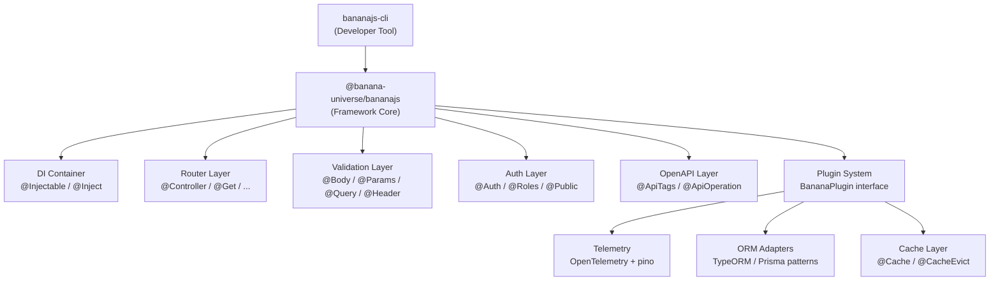

# BananaJS Enterprise Architecture Roadmap

## Current State Assessment

### `packages/bananajs` v0.0.7 — What Exists

- `BananaApp` — Express wrapper, single init point, global + per-route middleware wiring
- Route decorators: `@Controller`, `@Get/@Post/@Put/@Patch/@Delete`
- Validation decorators: `@Body/@Params/@Query(DtoClass)` via class-transformer + class-validator
- Response hierarchy: `SuccessResponse<T>`, `ApiError` subclasses, `ApiResponse` base
- Error middleware: `ErrorMiddleware` (4-arg Express handler)

### `packages/bananajs-cli` v0.0.10 — What Exists

- **One command only:** `bananajs new` — manual `process.argv[2]` routing, no Commander/Yargs
- inquirer prompts: app name + template type (MongoDB/SQL)
- Scaffolding via `git clone` of two external repos
- No `--help`, `--version`, no code generation, no plugin system

### Critical Bugs / Gaps Identified

- `[Validator.decorator.ts](packages/bananajs/src/lib/Validator/Validator.decorator.ts)`: validation failures respond with ad-hoc `{ status: 400, message }` — inconsistent with `ApiError`/`BadRequestResponse` stack
- `[Route.decorator.ts](packages/bananajs/src/lib/Router/Route.decorator.ts)`: duplicate `import 'reflect-metadata'` on lines 1 and 3
- `@Header` validator referenced in README does not exist in `ValidationSource` enum
- `[bananajs-cli/src/index.ts](packages/bananajs-cli/src/index.ts)` line ~73: `fs.rm(gitFolderPath, ...)` is fire-and-forget (not awaited)
- `fs.rmdir(..., { recursive: true })` is deprecated — should be `fs.rm`
- `[bananajs-cli.ts](packages/bananajs-cli/src/lib/bananajs-cli.ts)` is a placeholder stub, never imported

---

## Architecture Vision



---

## Phase 1 — Foundation (Months 0–3)

**Goal:** Fix all bugs, make the framework production-viable for small teams.

### 1.1 Bug Fixes (`packages/bananajs`)

- Fix validation error path in `[Validator.decorator.ts](packages/bananajs/src/lib/Validator/Validator.decorator.ts)` to throw `BadRequestError` and let `ErrorMiddleware` handle it (aligns all error shapes)
- Remove duplicate `import 'reflect-metadata'` from `[Route.decorator.ts](packages/bananajs/src/lib/Router/Route.decorator.ts)`
- Add `Headers` to `ValidationSource` enum and implement `@Headers(DtoClass)` decorator (closes README gap)

### 1.2 Bug Fixes (`packages/bananajs-cli`)

- Await `fs.rm(gitFolderPath, ...)` in `[setupAppConfiguration](packages/bananajs-cli/src/index.ts)`
- Replace deprecated `fs.rmdir` with `fs.rm(..., { recursive: true })`
- Remove dead stub `[bananajs-cli.ts](packages/bananajs-cli/src/lib/bananajs-cli.ts)` or wire it properly

### 1.3 Dependency Injection

Introduce a lightweight DI container (recommend `tsyringe` or `inversify`) so controllers are resolved from the container rather than `new Controller()` in `BananaApp.initializeControllers()`.

```typescript
// New pattern
@Injectable()
@Controller('/users')
export class UserController {
  constructor(private readonly userService: UserService) {}
}
```

- `BananaApp` accepts a DI container instance (optional, backward-compatible)
- Without container, existing `new Controller()` behavior retained

### 1.4 CLI Overhaul — Commander Foundation

Migrate `bananajs-cli` to `commander` for proper CLI structure:

```typescript
program.version('0.0.10')
program.command('new <appName>').description('Scaffold a new BananaJS app')
program.command('generate <type> <name>').alias('g').description('Generate a resource')
program.command('--help') // free from Commander
```

- Add `generate` command with sub-types: `controller`, `dto`, `middleware`
- Add `--dry-run` flag to `generate`
- Generate files locally (no network dependency for code gen)
- Code templates embedded in package (not remote git)

### 1.5 Security Baseline

- Add `helmet` integration: `BananaApp` applies secure HTTP headers by default (opt-out via config)
- Add CORS config option to `BananaApp` constructor: `{ cors: CorsOptions }`
- Add `X-Request-ID` middleware baked into app startup

### 1.6 Structured Logging

- Integrate `pino` as the default logger (fast, structured, JSON output)
- Expose `Logger` interface from public API so consumers can inject custom loggers
- `ErrorMiddleware` logs to the injected logger instead of `console.log`

---

## Phase 2 — Core Enterprise Features (Months 3–6)

**Goal:** Authentication, OpenAPI documentation, config management, testing utilities.

### 2.1 Authentication & Authorization Decorators

```typescript
@Controller('/admin')
@Auth() // require any authenticated user
export class AdminController {
  @Get('/reports')
  @Roles('admin', 'superuser') // require specific roles
  async getReports() {}

  @Get('/public-info')
  @Public() // opt-out of auth on this route
  async publicInfo() {}
}
```

- Framework provides the decorator metadata machinery; auth strategy (JWT, OAuth, API key) is injected as a plugin/middleware
- `AuthGuard` interface: `canActivate(req): boolean | Promise<boolean>`
- `RolesGuard` interface: extract roles from JWT claims or session

### 2.2 OpenAPI / Swagger Auto-Generation

Decorator-driven approach — metadata written at decoration time, extracted at startup:

```typescript
@ApiTags('Users')
@Controller('/users')
export class UserController {
  @ApiOperation({ summary: 'Create a user', description: '...' })
  @ApiBody({ type: CreateUserDto })
  @ApiResponse({ status: 201, type: SuccessResponse })
  @Post('/')
  @Body(CreateUserDto)
  async create(req: Request, res: Response) {}
}
```

- New `MetadataKeys` entries: `API_TAGS`, `API_OPERATION`, `API_BODY`, `API_RESPONSE`, `API_SECURITY`
- `BananaApp` reads OpenAPI metadata at startup and builds `openapi.json`
- Serve `/api-docs` (Swagger UI via `swagger-ui-express`) and `/api-docs.json`
- DTO classes auto-generate JSON Schema from `class-validator` annotations via `class-validator-jsonschema`
- Config: `BananaApp({ swagger: { enabled: true, path: '/api-docs', title: '...' } })`

### 2.3 Config Module

```typescript
// config.ts
export const AppConfig = BananaConfig({
  port: { env: 'PORT', default: 3000, type: 'number' },
  jwtSecret: { env: 'JWT_SECRET', required: true, sensitive: true },
  dbUrl: { env: 'DATABASE_URL', required: true },
})
```

- Validates env vars at startup; fails fast with clear messages if required vars missing
- Typed config object (no `process.env.X` strings scattered)
- Integrates with DI container

### 2.4 Testing Utilities

```typescript
import { BananaTestApp } from '@banana-universe/bananajs/testing'

const app = await BananaTestApp.create([UserController])
const res = await app.inject({ method: 'POST', url: '/users', body: { ... } })
```

- `BananaTestApp` wraps `supertest` + `BananaApp` for lightweight integration tests
- Mock factories for `SuccessResponse`, `ApiError` assertions
- No tests currently exist in the workspace — this establishes the pattern

### 2.5 Rate Limiting

```typescript
@RateLimit({ windowMs: 60_000, max: 100 })
@Controller('/api')
export class ApiController {}

@RateLimit({ windowMs: 10_000, max: 5 })
@Post('/login')
async login() {}
```

- Backed by `express-rate-limit`; Redis store integration for distributed deployments
- Decorator applies `express-rate-limit` middleware via the existing per-route/per-controller middleware chain

---

## Phase 3 — Advanced Architecture (Months 6–12)

**Goal:** Plugin system, ORM patterns, telemetry, caching, health checks, advanced CLI.

### 3.1 Plugin Architecture

```typescript
interface BananaPlugin {
  name: string
  register(app: Express, container: Container): void | Promise<void>
}

new BananaApp(Routes, {
  plugins: [
    new TypeOrmPlugin({ ...dbConfig }),
    new RedisPlugin({ url: 'redis://localhost' }),
    new OpenTelemetryPlugin({ serviceName: 'my-api' }),
  ],
})
```

- Plugins registered in order; each receives the Express instance and DI container
- Lifecycle hooks: `onRegister`, `onReady`, `onShutdown`
- Plugin authors publish `@banana-universe/plugin-*` packages

### 3.2 ORM / Database Integration Patterns

- **TypeORM plugin** (`@banana-universe/plugin-typeorm`): registers `DataSource` in DI container; exposes `@InjectRepository(Entity)` decorator
- **Prisma plugin** (`@banana-universe/plugin-prisma`): registers `PrismaClient` in DI container
- Repository pattern via DI injection — no static/global DB objects
- Transaction decorator: `@Transactional()` wraps method in a DB transaction

```typescript
@Injectable()
export class UserService {
  constructor(@InjectRepository(User) private repo: Repository<User>) {}

  @Transactional()
  async createWithProfile(dto: CreateUserDto) { ... }
}
```

### 3.3 Caching Layer

```typescript
@Cache({ ttl: 300, key: (req) => `user:${req.params.id}` })
@Get('/:id')
async getUser() {}

@CacheEvict({ pattern: 'user:*' })
@Put('/:id')
async updateUser() {}
```

- In-memory cache (Map + TTL) as default; Redis as drop-in replacement via plugin
- Cache key generation: manual key, param-based, or method-signature-based

### 3.4 Telemetry & Observability

- **Structured logging**: Request/response logging with correlation IDs (`X-Request-ID` propagated)
- **OpenTelemetry**: `@banana-universe/plugin-otel` wraps each route handler in an OTel span automatically; exports to Jaeger/OTLP
- **Metrics**: Prometheus-compatible `/metrics` endpoint (request count, latency histograms, error rates)
- **Health checks**:

```typescript
new BananaApp(Routes, {
  health: {
    enabled: true,
    path: '/health',
    checks: [dbHealthCheck, redisHealthCheck],
  },
})
```

- Health check returns `{ status: 'ok'|'degraded'|'down', checks: {...} }`

### 3.5 Advanced CLI — Generate & Manage

```bash
bananajs new <app-name>          # scaffold (existing, improved)
bananajs generate controller User   # create User.controller.ts + User.dto.ts
bananajs generate service UserService  # create UserService.ts with @Injectable
bananajs generate middleware LoggingMiddleware
bananajs generate module User    # controller + service + dto as a module
bananajs build                   # nx build wrapper
bananajs start [--watch]         # nx serve wrapper
bananajs openapi export [--out]  # export openapi.json from running app
```

- Template files embedded in CLI package (no network required for `generate`)
- Interactive mode: `bananajs generate` with no args launches inquirer prompts
- `--dry-run` prints files that would be created without writing
- Plugin system for CLI: `bananajs add @banana-universe/plugin-typeorm` installs + configures

### 3.6 Pagination Utilities

```typescript
// Framework-provided
class PaginatedResponse<T> extends SuccessResponse<T[]> {
  meta: { page: number; limit: number; total: number; totalPages: number }
}

class PaginationDto {
  @IsOptional() @IsInt() @Min(1) page?: number = 1
  @IsOptional() @IsInt() @Min(1) @Max(100) limit?: number = 20
}
```

---

## Phase 4 — Enterprise & AI-First (Months 12–24)

**Goal:** Multi-tenancy, AI-powered DX, performance infrastructure, advanced security.

### 4.1 AI-First CLI Capabilities

- `bananajs ai generate --from-schema schema.json` — generate controller + DTO + service from JSON Schema or OpenAPI spec
- `bananajs ai generate --from-prompt "CRUD API for blog posts with auth"` — LLM-driven scaffolding via OpenAI/Anthropic API (key configured)
- `bananajs ai doc` — generate JSDoc and update Swagger metadata from LLM analysis of existing controllers
- `bananajs ai review` — static analysis + LLM review of a controller for BananaJS best practices

### 4.2 Advanced Security Hardening

- `@Sanitize` decorator: runs `dompurify`/`sanitize-html` on string fields before handler
- ABAC (Attribute-Based Access Control) via `@Can('action', 'resource')` decorator
- Secrets rotation hooks: config module emits `onSecretRotated` event
- OWASP-aligned defaults: CSP headers via helmet, SQL injection prevention via ORM adapter contract
- `@Throttle` (granular per-user rate limiting via user ID extracted from JWT)

### 4.3 Multi-Tenancy Support

```typescript
@Controller('/users')
@Tenant() // injects tenantId from JWT into request context
export class UserController {}
```

- `TenantContext` available via DI in services
- Per-tenant DB connection pooling patterns via ORM plugins
- Tenant-scoped caching key namespacing

### 4.4 Performance & Benchmarking Infrastructure

- `@Patch` route microbenchmarks: middleware chain cost per route, decorator overhead measurements
- `autocannon`/`k6` benchmark suite as a separate `apps/benchmarks` package
- GitHub Actions CI job: fail if p99 latency regresses by >10% vs baseline
- Lazy controller loading: `BananaApp` only instantiates controllers on first request to their base path
- Route tree caching: precomputed route map at startup instead of per-request metadata reads

### 4.5 WebSocket / SSE Support

```typescript
@WsController('/events')
export class EventController {
  @OnConnect()
  handleConnect(socket: WebSocket) {}

  @OnMessage('chat')
  handleChat(socket: WebSocket, @WsBody(ChatDto) data: ChatDto) {}
}
```

- `ws` library integration via a first-party `@banana-universe/plugin-websocket`

---

## Dependency Summary

### Phase 1 additions

- `commander` — CLI command routing
- `pino` + `pino-http` — structured logging
- `helmet` — security headers
- `cors` — CORS handling
- `uuid` — request ID generation
- `tsyringe` or `inversify` — DI container (TBD based on decorator-compat testing)

### Phase 2 additions

- `swagger-ui-express` — Swagger UI serving
- `class-validator-jsonschema` — DTO → JSON Schema for OpenAPI
- `express-rate-limit` — rate limiting
- `supertest` — testing utilities
- `zod` or custom — env config validation

### Phase 3 additions

- `@opentelemetry/sdk-node` + `@opentelemetry/auto-instrumentations-node` — OTel
- `prom-client` — Prometheus metrics
- `ioredis` — Redis (cache + rate limit store)
- TypeORM or Prisma (plugin packages, not core dep)

---

## Effort & Priority Matrix

- **Phase 1** (0–3 months): SMALL–MEDIUM tasks; 1–2 engineers; unblocks production use
- **Phase 2** (3–6 months): MEDIUM tasks; 2–3 engineers; unlocks enterprise adoption
- **Phase 3** (6–12 months): LARGE tasks; 3–4 engineers + plugin contributors; unlocks ecosystem
- **Phase 4** (12–24 months): LARGE–XL tasks; full team; differentiates vs NestJS

---

## Backward Compatibility Strategy

- All Phase 1–2 additions are **additive** — new decorators, new constructor config options with defaults
- `BananaApp(Routes)` (current signature) remains valid throughout all phases
- DI container is **opt-in** — if no container passed, existing direct instantiation is retained
- Semantic versioning: Phase 1 = v0.1.x, Phase 2 = v0.2.x–v0.3.x, Phase 3 = v1.0.0 (stable), Phase 4 = v2.0.0
