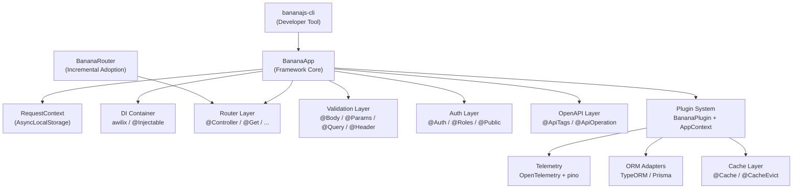

# Roadmap Update: Enterpirse_Roadmap2.md

## Source File

[plans/Enterpirse_Roadmap2.md](plans/EnterpriseRoadmapV2.md) — full rewrite in-place, same filename.

## Key Structural Changes

### 1. Add "Integration-First Architecture" section (new, before Phase 1)

Documents the philosophy with concrete API surface:

- `BananaRouter` export for mounting in existing Express apps
- `AsyncLocalStorage`-based `RequestContext` as a foundational primitive
- Express middleware passthrough guarantee

### 2. Add "Quick Wins" section (new, before Phase 1)

5 items executable immediately, zero phase dependency:

- Fix validation bug correctly (throw `BadRequestError`, no double-response)
- Export `BananaRouter` (~15 lines)
- Remove all `any` from public API
- Add VS Code snippets file to CLI template
- Add `BananaApp.getRouteTable()` debug method

### 3. Phase 1 — Foundation (revised: Months 0–5, not 0–3)

**Reorder:** 1.6 Logging before 1.5 Security (request ID needs logger context first).
**Add items:**

- 1.0 TypeScript strict mode (`any` removal, typed `BananaAppOptions` options object, `Constructor<T>` generics)
- 1.5b Async bootstrap lifecycle (`BananaApp.create()` static async factory)
- 1.7 `AsyncLocalStorage` request context (`RequestContext` with correlation ID, user context slot)
- 1.8 Graceful shutdown (SIGTERM/SIGINT + connection draining, ~50 lines)
- 1.9 Minimal testing utilities (moved from Phase 2: `BananaTestApp.create()` + supertest wrapper)

**Update bug fix description (1.1):** Correct the validation bug description — it's not just "inconsistent response shape," it's a double-response crash: `response.send()` is called AND the return value is thrown, causing a 500 via `ErrorMiddleware`. Fix is `throw new BadRequestError(...)` with no `response.send()`.

**Update DI choice (1.3):** Replace "recommend `tsyringe` or `inversify`" with "evaluate `awilix` as primary candidate (function-based, no `reflect-metadata` dependency, ESM-native, actively maintained); tsyringe/inversify as fallback."

### 4. Phase 2 — Core Enterprise Features (revised: Months 5–9)

**Move in from Phase 3:** Basic health check endpoint (Kubernetes readiness/liveness prerequisite).
**Move in from Phase 3:** Pagination utilities (`PaginatedResponse`, `PaginationDto`).
**Update 2.2 OpenAPI:** Replace `class-validator-jsonschema` (high-risk dependency, ~2K weekly downloads, sparse maintenance) with generating JSON Schema directly from explicit decorator metadata. Evaluate `@scalar/express-api-reference` as Swagger UI alternative to `swagger-ui-express`.
**Add 2.6 Migration Guide:** Step-by-step Express → BananaJS migration docs, documents `BananaRouter` incremental adoption path, Express middleware passthrough patterns, `express-validator` → BananaJS validation decorator migration.
**Add 2.7 File upload formalization:** `@Upload('field')` decorator backed by multer (exists as `FileUpload.middleware.ts` but is not roadmapped).
**Add 2.8 Express 5 readiness:** Test compatibility, document behavior changes (promises auto-caught, path syntax, `app.del()` removal).
**Fix rate limiting Redis note (2.5):** Explicitly state Redis store deferred to Phase 3 plugin.

### 5. Phase 3 — Advanced Architecture (revised: Months 9–15)

**Remove:** Pagination utilities and health checks (moved to Phase 2).
**Add 3.7 TC39 Decorator migration plan:** Audit all `emitDecoratorMetadata` usage; design explicit metadata registration fallback; publish migration guide before v1.0.0.
**Add 3.8 Zod validation adapter plugin:** `@banana-universe/plugin-zod` enabling `@Body(UserSchema)` where `UserSchema` is a Zod schema (no class-validator decorators required).
**Add to 3.5 Advanced CLI:** `bananajs routes` command (route table), `bananajs migrate --scan` codemod for Express route files, `/_banana/routes` runtime introspection endpoint, `bananajs openapi export --client typescript` client SDK generation.
**Update 3.1 Plugin interface:** Change `register(app: Express, container: Container)` to `register(ctx: AppContext, container: Container)` to avoid leaking Express abstraction.

### 6. Phase 4 — Enterprise & AI-First (revised: Months 15–27)

**Update 4.1 AI CLI:** Use Vercel `ai` SDK as abstraction layer instead of direct OpenAI/Anthropic imports.
**Add 4.6 Fastify adapter exploration:** `@banana-universe/adapter-fastify` — allows `BananaApp` to run on Fastify instead of Express under the hood.
**Add 4.7 TC39 decorator migration execution:** Ship TC39 decorator support, deprecate `experimentalDecorators` path.

### 7. Updated Dependency Summary

- Phase 1: Replace `tsyringe`/`inversify` → `awilix` (primary candidate)
- Phase 2: Replace `class-validator-jsonschema` → custom metadata extraction; add `@scalar/express-api-reference` as alternative to `swagger-ui-express`; add `multer`
- Phase 3: Add `zod` (Zod plugin), `openapi-typescript` (client SDK generation)
- Phase 4: Add `ai` (Vercel AI SDK)

### 8. Add "Dependency Risk Register" section

Table of risky dependencies with risk level, concern, and mitigation per architect analysis.

### 9. Updated Backward Compatibility section

- Add note that `BananaApp(Routes)` constructor gains an async `.bootstrap()` call path; sync constructor retained as legacy
- Add "Migration from plain Express" subsection referencing `BananaRouter`

### 10. Updated Effort & Priority Matrix

Reflect revised phase timelines and team sizes.

### 11. Update todos frontmatter

Add new todos for all new items (BananaRouter, AsyncLocalStorage, graceful shutdown, async bootstrap, typed API, migration guide, Zod plugin, TC39 plan, etc.).

## Mermaid Architecture Diagram Update

Update the existing `flowchart TD` to include: `RequestContext` node, `BananaRouter` export node, `AppContext` abstraction replacing raw Express reference in plugin interface.

