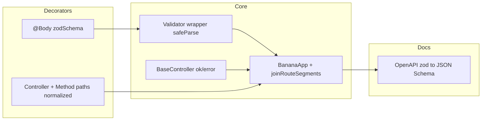

# Framework: Zod validation, BaseController, route normalization, declarative bootstrap

I have loaded context using Rosetta: this is a **large, cross-cutting** change (framework core, plugins, CLI, all example apps, docs-site, and workspace docs). It aligns with [docs/ARCHITECTURE.md](docs/ARCHITECTURE.md) validation and routing sections and extends the direction already noted in [agents/IMPLEMENTATION.md](agents/IMPLEMENTATION.md) (Zod plugin coexists with class-validator today—this plan **replaces** that coexistence with Zod as the single path).

**Implementation workflow:** follow [workflows/coding-flow.md](workflows/coding-flow.md) (Rosetta coding-flow): discovery → tech specs → implementation → review/validation.

**Versioning:** treat as a **breaking** release (e.g. `0.5.0`): remove `class-validator` / `class-transformer` from the default story, change decorator path strings, and require controllers to extend `BaseController`.

---

## 1. Zod as default validation (remove class-validator)

**Core behavior**

- Replace [packages/bananajs/src/lib/Validator/Validator.decorator.ts](packages/bananajs/src/lib/Validator/Validator.decorator.ts) implementation: instead of `plainToInstance` + `validate`, use `**schema.safeParse(req[source])` (same structural pattern as [packages/plugin-zod/src/index.ts](packages/plugin-zod/src/index.ts)).
- Public API: keep names `**@Body`**, `**@Query`**, `**@Params**`, `**@Headers**`but their first argument becomes a`**z.ZodType**`(not a DTO class). On success, assign`\*\*result.data\*\*`back onto`req[source]`(or a typed narrow—match current behavior of mutating`req` for downstream handlers).
- Error shape: keep `**BadRequestError**` with joined Zod issue messages (consistent with today’s 400 behavior).
- **Dependencies:** add `**zod`** (and likely `**zod-to-json-schema`** or equivalent) to [packages/bananajs/package.json](packages/bananajs/package.json); **remove** `class-transformer`and drop`\*\*class-validator` from peers/deps as applicable.

**OpenAPI**

- [packages/bananajs/src/lib/OpenAPI/schema.extractor.ts](packages/bananajs/src/lib/OpenAPI/schema.extractor.ts) currently uses `getMetadataStorage()` from `class-validator`. Replace with a `**zodToJsonSchema` (or similar) path for Zod schemas.
- Extend [packages/bananajs/src/lib/OpenAPI/ApiDoc.decorators.ts](packages/bananajs/src/lib/OpenAPI/ApiDoc.decorators.ts) `**ApiBodyOptions`**: support `type?:` **either** legacy class (remove) **or** document `**zodSchema`/ unify on Zod-only per decision in implementation. [packages/bananajs/src/lib/OpenAPI/swagger.setup.ts](packages/bananajs/src/lib/OpenAPI/swagger.setup.ts) should call the new extractor when building`requestBody`.

**Pagination**

- [packages/bananajs/src/lib/Pagination/Pagination.ts](packages/bananajs/src/lib/Pagination/Pagination.ts): replace `**PaginationDto`** class-validator decorators with an exported `**PaginationQuerySchema\*\*` (`z.object`+`coerce` for query params) and adjust any helpers that referenced the class.

**Downstream packages**

- `**plugin-websocket`**: [packages/plugin-websocket/src/WsRouter.ts](packages/plugin-websocket/src/WsRouter.ts) — switch `@WsBody` validation from class-validator to Zod `**safeParse\*\*`; update [packages/plugin-websocket/src/WsDecorators.ts](packages/plugin-websocket/src/WsDecorators.ts) docs.
- `**plugin-zod`**: either **deprecate and re-export core decorators from `@banana-universe/bananajs`, or remove duplication so the plugin becomes a thin compatibility shim for one release—avoid two competing implementations.

**CLI and templates**

- Update [packages/bananajs-cli/src/lib/generate-module.ts](packages/bananajs-cli/src/lib/generate-module.ts), [generate-ai-module.ts](packages/bananajs-cli/src/lib/generate-ai-module.ts), [generate.ts](packages/bananajs-cli/src/lib/generate.ts), [templates/legacy-scaffold.ts](packages/bananajs-cli/src/lib/templates/legacy-scaffold.ts), [migrate.ts](packages/bananajs-cli/src/lib/migrate.ts) to emit **Zod schemas** and `@Body(schema)` / `@Query(schema)` instead of class-validator DTOs.

**Apps / examples**

- Migrate DTOs in `apps/example-*` (e.g. [apps/example-multitenant/src/note/note.dto.ts](apps/example-multitenant/src/note/note.dto.ts), PostgreSQL catalog DTOs, [apps/example-websocket-chat/src/chat.dto.ts](apps/example-websocket-chat/src/chat.dto.ts)) to Zod; remove `**@banana-universe/plugin-zod` imports where inlined into core ([apps/example-rest-mongodb/src/article.controller.ts](apps/example-rest-mongodb/src/article.controller.ts) already uses `ZodBody`—fold into `@Body`).

**Documentation**

- Update [docs/ARCHITECTURE.md](docs/ARCHITECTURE.md), [docs/DEPENDENCIES.md](docs/DEPENDENCIES.md), [docs/TECHSTACK.md](docs/TECHSTACK.md), [docs/CODEMAP.md](docs/CODEMAP.md), [docs/PATTERNS/dto-class-validator.md](docs/PATTERNS/dto-class-validator.md) (rename/replace with a Zod pattern doc), [docs/MIGRATION.md](docs/MIGRATION.md), [README.md](README.md), and **docs-site** guides ([docs-site/guide/basic-concepts.md](docs-site/guide/basic-concepts.md), [docs-site/guide/getting-started.md](docs-site/guide/getting-started.md), [docs-site/integrations/zod.md](docs-site/integrations/zod.md), [docs-site/reference/decorators.md](docs-site/reference/decorators.md)).

---

## 2. `BaseController` (standard response/error helpers)

**Design**

- Add `**BaseController` in `packages/bananajs` (new file under e.g. `lib/Controller/BaseController.ts`, exported from [packages/bananajs/src/index.ts](packages/bananajs/src/index.ts)).
- Provide `**protected` helpers that wrap existing types from [packages/bananajs/src/lib/Response/ApiResponse.ts](packages/bananajs/src/lib/Response/ApiResponse.ts) and [ApiError](packages/bananajs/src/lib/Response/ApiError.ts), e.g.:
  - `**this.ok(res, message, data)` → `SuccessResponse` + `send(res)`
  - `**this.error`**: either thin wrappers for throwing `**ApiError`**subclasses or`**this.fail(res, err)`**—match user intent of `\*\*this.error\*\*`without duplicating`ErrorMiddleware`responsibilities (document that thrown`ApiError` remains the primary error path).
- **Requirement:** all example and generated controllers `**export class X extends BaseController` (TypeScript enforcement via abstract base or documented convention; optional dev-only assertion if useful).

**Migration:** update every controller in `apps/*`, `packages/bananajs-cli` templates, and [apps/bananajs-demo](apps/bananajs-demo) to extend `BaseController` and replace raw `new SuccessResponse(...).send(res)` with `this.ok(...)` where appropriate.

---

## 3. Route decorators: no leading slashes (routing joins segments)

**Current behavior:** `[App.ts](packages/bananajs/src/lib/Core/App.ts)` concatenates `basePath` and `path` for the route table (`${basePath}${path}`) and mounts `router.use(basePath, router)` while registering handlers with raw `path` on the nested router ([lines 323–326, 459–490, 490](packages/bananajs/src/lib/Core/App.ts)).

**Target behavior**

- `**@Controller('articles')`** not `@Controller('/articles')`; `**@Get('healthz')`**, `**@Post('')`**or`**@Post()`for collection root—product decision: support`\*\*''\*\*` and optional default for “index” route.
- Centralize `**joinRouteSegments(...parts: string[])` (or similar) used by:
  - `[Controller.decorator.ts](packages/bananajs/src/lib/Router/Controller.decorator.ts)` (normalize stored base)
  - `[Route.decorator.ts](packages/bananajs/src/lib/Router/Route.decorator.ts)` (normalize method path)
  - `[initializeControllers](packages/bananajs/src/lib/Core/App.ts)` and `[BananaRouter](packages/bananajs/src/lib/Core/App.ts)` so **Express** receives consistent paths (leading `/` on inner router paths, mount path without double slashes).
- **Route table** `RouteInfo.path` should remain a single canonical full path string (e.g. `/articles/healthz`) for OpenAPI and DevTools.

**Sweep:** grep for `@Controller('/` and `@Get('/` etc. across repo and update CLI/templates/docs examples to slash-free segments.

---

## 4. Declarative app initialization

**Problem:** [apps/example-multitenant/src/bootstrap.ts](apps/example-multitenant/src/bootstrap.ts) manually builds Awilix, wires services, passes `BananaApp.create`, and toggles many options—hard to scan.

**Proposed API (concrete shape to finalize in specs)**

- Add something like `**defineBananaApp(options)`** or `**createBananaApplication(config)`**in core (or a small`packages/bananajs-bootstrap` if you want zero core API surface—prefer core for discoverability) that accepts:
  - `**controllers`
  - `**plugins`**, `**auth`**, `**abac**`, `**tenant**`, `**container**`(Awilix container or a`**register(c)**`callback),`**port`/`listen`**, and sensible defaults so demos do not repeat `logger: false`, `gracefulShutdown: false`, etc. unless overridden.
- Implement `**listen(port)`** or `**start()`**that runs`**BananaApp.create`**internally and calls`\*\*getInstance().listen\*\`.
- Refactor **example-multitenant** to a short `**main.ts`** (or `app.ts`) that reads env and calls the declarative helper; keep `**buildTypeOrmOptions\*\` as a focused helper or fold into config.

**Note:** This does not remove Awilix—it **hides** repetitive wiring behind one typed config object.

---

## 5. Dependency / test matrix

- Run `**tsc`/Nx builds for `bananajs`, `bananajs-cli`, `plugin-websocket`, affected apps.
- Add or update a small number of tests if a test harness exists; [docs/ARCHITECTURE.md](docs/ARCHITECTURE.md) notes sparse tests—at minimum manual smoke of one REST and one multitenant app.

---

## Architecture sketch

---

## Risk / scope note (Rosetta guardrail)

This touches **more than 15 files** and multiple packages. If you need to ship incrementally, the safest order is: **(3) route normalization** (mechanical), **(1) Zod validation** + OpenAPI + examples, **(2) BaseController**, **(4) declarative bootstrap**—or implement **(1)+(3)** together since both affect the same controllers.
