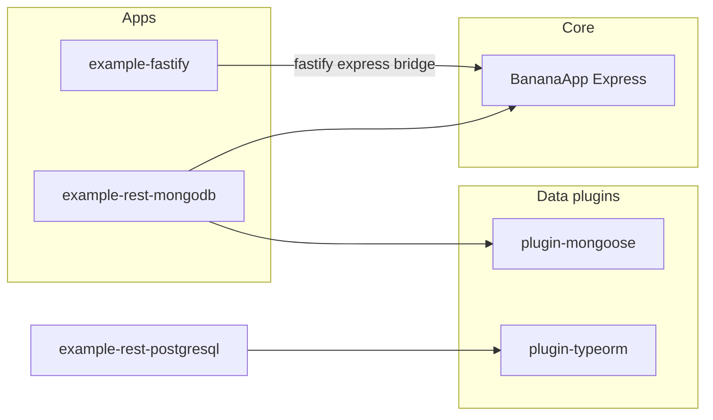

# Framework changes: Mongoose, Fastify recipe, declarative bootstrap

I have loaded context using Rosetta: this is an Nx monorepo whose core is Express-based `[BananaApp](packages/bananajs/src/lib/Core/App.ts)` (no `FrameworkAdapter` wiring yet); Mongo today is `[example-rest-mongodb](apps/example-rest-mongodb)` + `[plugin-prisma](packages/plugin-prisma)`; `[adapter-fastify](packages/adapter-fastify/README.md)` is a type-level stub. You chose the **Fastify + `@fastify/express` bridge** for the recipe (not full native adapter work).

---

## 1. Remove Prisma; add Mongoose

**Remove**

- Package `[packages/plugin-prisma](packages/plugin-prisma)` (entire tree) and every import/reference: CLI generators (`[generate-module.ts](packages/bananajs-cli/src/lib/generate-module.ts)`, `[generate-ai-module.ts](packages/bananajs-cli/src/lib/generate-ai-module.ts)`), `[bananajs db --status](packages/bananajs-cli/src/index.ts)` Prisma branch, root `[package.json](package.json)` `@prisma/client`, CI `[.github/workflows/ci.yml](.github/workflows/ci.yml)` Prisma generate step, `[.github/workflows/publish.yml](.github/workflows/publish.yml)` `plugin-prisma` job, docs (`[docs-site/integrations/prisma.md](docs-site/integrations/prisma.md)`, nav in `[docs-site/.vitepress/config.ts](docs-site/.vitepress/config.ts)`, examples table, guides mentioning Prisma), `[docs/MULTI-TENANCY.md](docs/MULTI-TENANCY.md)`, `[agents/IMPLEMENTATION.md](agents/IMPLEMENTATION.md)`.

**Add**

- New package `**@banana-universe/plugin-mongoose`* (mirror the *shape of `[plugin-typeorm](packages/plugin-typeorm/src/index.ts)` / old Prisma plugin):
  - `**MongoosePlugin(connection: Connection)` (or `mongoose` + URI): `register` — register connection and optional models on Awilix; `onShutdown` — `connection.close()`.
  - `**@Transactional()`** for MongoDB **multi-document** transactions via **sessions where supported; document that standalone Mongo has no transactions / replica set required (same class of caveats as current Prisma Mongo README).
  - `**MongooseRepositoryAdapter` (optional but aligns with DDD): same role as `[PrismaRepositoryAdapter](packages/plugin-prisma/src/PrismaRepositoryAdapter.ts)` — bridge `Repository<T>` to Mongoose model with mappers.

**Migrate example app**

- Refactor `[apps/example-rest-mongodb](apps/example-rest-mongodb)`: remove `prisma/`, `prebuild`/`pretest` prisma generate; define **Mongoose schema/model** for `Article`; update `[article.controller.ts](apps/example-rest-mongodb/src/article.controller.ts)` and `[bootstrap.ts](apps/example-rest-mongodb/src/bootstrap.ts)` to inject `Connection` or model + `MongoosePlugin`; adjust `[__tests__/app.test.ts](apps/example-rest-mongodb/src/__tests__/app.test.ts)` and `[README.md](apps/example-rest-mongodb/README.md)` (rename description to Mongoose + Zod).
- Update **Nx/tsconfig** references: drop `plugin-prisma` project ref; add `plugin-mongoose`.

**CLI**

- Replace ORM choice `**typeorm | prisma | none`** with `**typeorm | mongoose | none\*\`(including`[llm/bananarc.ts](packages/bananajs-cli/src/lib/llm/bananarc.ts)`, prompts, AI generator templates).

---

## 2. Fastify recipe (bridge — your choice)

Add `**apps/example-fastify` (name can be `example-fastify-express` in README title for clarity):

- Dependencies: `fastify`, `@fastify/express`, `@banana-universe/bananajs`, shared plugins as needed.
- Flow: `await BananaApp.create(controllers, options)` → `banana.getInstance()` returns Express `Application` → register with `@fastify/express` → `fastify.listen(...)`.
- Reuse the same **declarative bootstrap** helper (below) so the file reads as a short “recipe.”
- Document in app `README.md`: hybrid model (Fastify process, Express HTTP stack for Banana routes), when to prefer pure Express examples.

No change **required** to `[adapter-fastify](packages/adapter-fastify)` for this milestone (stub can stay; optionally add a one-line README pointer to the new example).

---

## 3. Declarative, readable DI and bootstrap

Today, apps manually call `createContainer()` + many `asFunction` registrations (`[example-rest-mongodb/bootstrap.ts](apps/example-rest-mongodb/src/bootstrap.ts)`, `[example-rest-postgresql](apps/example-rest-postgresql/src/bootstrap.ts)`).

**Proposed API** (in `packages/bananajs`, small surface):

- `**createBananaContainer(registrations)` — thin wrapper around `createContainer()` + `register()` with typed ergonomics.
- `**defineBananaApp(options)`** — accepts `{ controllers, container?, plugins?, ...BananaAppOptions }` and returns the same shape `BananaApp.create` expects, OR a single `**bootstrapBananaApp({ modules: [...] })\*\`where each module exports`{ register: (c) => void, controllers?: Constructor[] }`.

Pick **one** pattern and apply it to **2–3 examples** (e.g. migrated Mongo example, PostgreSQL example, new Fastify app) so the style is consistent. Prefer **minimal** abstraction (KISS): e.g. composable `registerServices(container, { ... })` objects rather than a full Nest-like module system unless you explicitly want modules.

**Controller resolution** today uses **camelCase of class name** (`[resolveController](packages/bananajs/src/lib/Core/App.ts)` `ArticleController` → `articleController`). Any helper must preserve this contract or document a breaking change.

---

## Architecture (high level)

---

## Risks and notes

- **Breaking change**: removing `@banana-universe/plugin-prisma` requires a **semver major** or clear deprecation window; call out in changelog.
- **Scope**: touches many files (packages, apps, CI, docs, CLI). Aligns with Rosetta “large” request — use subagents for parallel doc/CLI/package streams during execution.
- **Validation**: after changes, `nx run-many -t build` / typecheck for affected projects; run example tests; update lockfile when removing Prisma and adding mongoose/fastify deps.

---

## Implementation workflow

Use Rosetta `**workflows/coding-flow.md`: discovery (done in this plan) → implementation with review/validation gates → update `[agents/IMPLEMENTATION.md](agents/IMPLEMENTATION.md)` and relevant docs per task.
